> 第一、二周任务

> 

# 前言

## 背景


- 桌面应用开发中Java不常用


- 移动设备应用中Java不常用


## 环境配置

### JDK


- 下载及配置JDK过程略


- win+R打开cmd检测是否配置成功

```java
java --version
javac --version
```


### 环境变量


- path环境变量配置后即可在任意目录中启动程序，不配置的话需跳转到其程序所在目录才能启动


- 右键菜单选择系统再选择高级系统设置，选环境变量


- 选择系统变量中的Path再编辑，新建变量即可，复制 java\bin 和 Java\jre\bin 的目录添加两个变量（一般执行程序的文件都在bin目录下）
- 配置到用户变量可以只针对与当前登录的用户有效，切换用户后无法生效


- 在系统变量处选择新建，输入变量名和变量值，新建后就可以用 %变量名% 代替 变量值 ，即可以 %Java_Home% 代替 D:\Java
- 若Java_Home的变量值更改，即可只更改Java_Home的值便可顺带更改了Path中相关的环境变量


### IDEA

#### 安装


- 下载安装略，一般都去官网上下载


- Ultimata旗舰版支持JavaEE开发等功能，适合企业级开发，Community社区版不支持


- 卸载老版IDEA，打开控制面板选择程序，再选择卸载程序，右键卸载即可
- 安装IDEAIU（Ultimata）过程略

#### 基础设置


#### 常用快捷键


- main：为main函数，public static void main(String[] args){}
- sout：代表输出语句，System.out.println(a[i]);
- "xxx".sout/xxx.sout ：代表输出 xxx字符串/xxx
- fori：代表for循环，以i为循环变量，for其他字母无法当作快捷语句， for (int i = 0; i < ; i++){}
- x.fori：代表遍历x数组，for (int i = 0; i < x.length; i++) {}
- alt+回车，回车：调用一个未定义的方法，加入实参后，检查报错改正，会在所在类中自动生成  private static +返回类型+方法名+(形参列表){}  只需完成内部语句即可

<br/>

- ctrl+D ：复制当前行并粘贴到下一行
- ctrl+alt+L ：格式化代码
- ctrl+Y ：删除当前行代码
- alt+shift+⬆/⬇ ：将当前行代码上移/下移一行
- ctrl+/ ：单行注释
- ctrl+shift+/ ：多行注释

<br/>

- alt+回车：解决报错问题 
- ctrl+C ：复制当前行代码
- ctrl+X ：剪切当前行代码

#### 其他操作


- 删除类文件：右键、delete
- 修改类名称：右键、重构、重命名
- 修改模块：右键、重构、重命名、重命名模块和目录（目录指在原文件夹中的名称）

> 打开文件在文件夹中所在的位置：右键、打开于、资源管理器

- 导入模块：


1. 必须选择所要导入的模块的 .iml 文件才能导入
2. 若所导入的模块位置不在工程所在目录下，导入后文件实际位置不在该目录下，若想使其位置在工程目录下，需复制文件夹到工程目录下再使用以上方式
3. 也可直接新建模块，再复制其他模块的src文件夹到该模块目录下

- 删除模块：先右键、移除模块，再打开其实际位置将其文件夹删除才能做到真正删除

> 移除模块后可以重新导入模块

> 移除模块后模块的文件依旧被git管理

> 移除模块可以简化项目结构，减少不必要的代码和依赖，提高项目的可维护性和可读性。当我们需要删除某个模块时，可以通过移除模块来达到这个目的。移除模块后，我们可以更加专注于项目的核心功能，减少不必要的开销和复杂度。同时，移除模块也可以帮助我们更好地管理项目的依赖关系，避免出现冲突和错误

> 不显示已经移除的模块的方法：Idea项目目录改为软件包目录
> 
> 如果删除了.idea目录，需再重新导入总工程模块iml文件，此时git版本控制显示，然后再导入所需模块，再打开项目结构，选择SDK、语言级别和编译器输出目录（默认为out目录）

- 打开工程：文件、打开，再选择相应文件夹即可（右下角有黑框）
- 关闭工程：文件、关闭项目

#### Debug


- 单击行标处可以产生红色的断点，右键该行选择调试，即可进入Debug模式


- 进入调试界面后点击↓箭头，可以执行从断点往后的语句，第一次点击执行断点所在行代码，以此类推，一步步来
- 遇到循环结构时，会在循环体中按循环次数一次次按行运行
- 遇到分支结构时，会直接跳入对应分支，运行完分支后，再跳出分支运行下面的内容
- 遇到输入时，需要在控制台中输入相关数据，再转到线程和变量，才能继续往下调试


- 点击向右的三角箭头，再打开控制台，可以运行完以后的程序步骤

## DOS命令行窗口常用命令


- 切换盘符只需 D: 或 C: 即可，无需cd
- dir可查看当前目录下目录与文件


- cd+目录名 可以切换到当前目录下的目录中，cd+目录地址可以切换到该地址目录（当前盘下才可以，不能跨盘），cd .. 为返回上一级目录


- 先cd到别的盘的某一目录，再切盘可以跳转到另一盘的目录中


- cd / 可以切换到本盘根目录下
- cls可用于cmd窗口清屏

```
cd D:
cd ..
cd /
cd xxx
dir
cls
```

## 编译运行java文件（javac+java 记事本＋命令行运行方式）


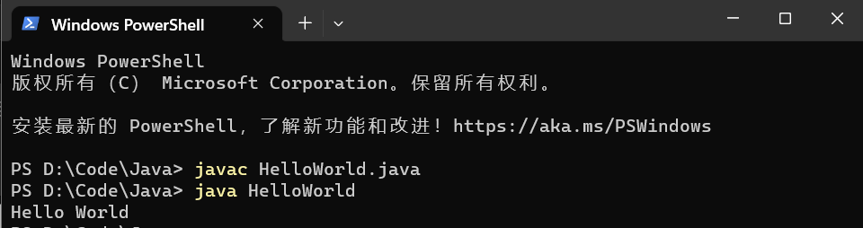

- 先javac后java，javac后会产生HelloWorld.class文件


- JDK11后可直接java+文件名编译运行，不产生.class文件


```
javac HelloWorld.java
java HelloWorld

java HelloWorld.java
```


## 原理方面

### 编程语言发展


- 打孔代表通电，不打不通电


### BUG


- debug抓虫子

### JDK


- JVM虚拟机，JRE运行环境，JDK开发工具，核心类库自身程序
- .java文件先通过JDK中的开发工具中的javac编译为.class文件，再通过java运行.class文件转到JRE的JVM中，再到核心类库运行


- 不同平台上都有JVM虚拟机


## IDEA第一个工程

### 结构


### 新建工程（project、module、package、class）


- 新建空项目，便于添加模块和包


- 模块名取名-app代表应用模块


- 包名一般为域名倒写，src为源文件目录


- 不用写 .java 后缀


- 输入main回车后可自动生成main函数


- 输入sout回车即可调用打印函数


- 右键运行或点击三角号运行文件


- 包名中一个 . 是一级目录


## 总结


# 基础语法

## 注释


- 文档注释可以提取到文档说明书中去


- .class文件中去掉了注释的部分

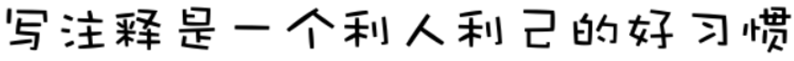


- 再次按下快捷键可以取消注释


```java
//

/*

*/

/**

*/
```

## 字面量


- 不能写 '' 或 "" ，引号之间需要有内容


## 变量

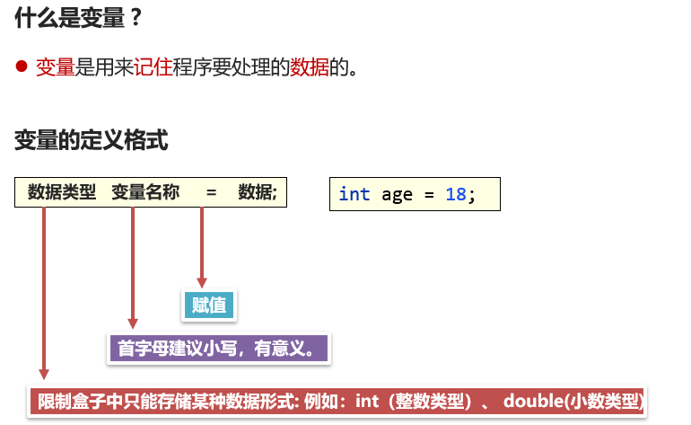

- 变量名首字母小写，类名首字母大写


- 变量的作用：便于扩展和维护，其值会发生改变


### 注意事项


- 同一作用域内，不可以定义同名变量，改变数据类型也不行，不能int a然后double a


### 底层原理


- 110，从后往前每一位为2的0，1，2，3……次方


- 余数从下往上排下来


- 字节为B（byte），位为b（bit）


- 字符的ASCII码可以±整数，更改为其他字符ASCII码


### 进制转换


- 二进制数每一位乘2的某次方再加起来就是十进制数


- 计算器的程序员模式可以查看一个数的二、八、十、十六进制数


```java
System.out.println(0B110);
System.out.println(0b110);
System.out.println(0156);
System.out.println(0x156);
System.out.println(0XA56);
```

- 二进制为0B/0b开头，八进制为0开头，十六进制为0x/0X开头
- 输出时输出的均为十进制数


## 关键字和标识符


- 变量名首字母小写，类名首字母大写，驼峰命名法


## 数据类型

- Java是强类型语言

### 基本数据类型


```java
byte b = 123;
short s = 12456;
int i = 112313;
long l = 123456789123456L;

float f = 123.5F;
double d = 123456.6564;

char c1 = 'a';
char c2 = '中';

boolean b1 = true;
boolean b2 = false;

String str = "hello";
```

- 默认是int/double，若用long必须在数字后面加上L/l，若用float必须在数字后面加上F/f
- char字符也可以是中文
- boolean类型的true/false不能用1/0代替，1/0不能作为判断条件，如不能用while(1)


### 引用数据类型

***变量名存储的是内存地址，则变量的类型是引用数据类型***

- String为字符串类型，定义的变量可以存储一个字符串数据
- 数组类型，数组名存储的是数组对象的内存地址
- 

## 类型转换

### 自动类型转换


```java
byte a = 123;
int b = a;
char c = 'a';
int d = c;
System.out.println(a);
System.out.println(b);
System.out.println(c);
System.out.println(d);
```


#### 表达式自动类型转换


- byte、short、char之间进行加减运算时最后结果都是int，【byte+byte也是int】，目的是为了防止溢出


### 强制类型转换


- 浮点型转整型，向下取整保留整数部分，负数也一样，(int)5.5=5, (int)-2.5=-2


## 运算符

### 算术运算符


- 没有小数时，两个整数的除法还是整数，可以用1.0*原表达式，可以得到小数结果
- 小数%整数 或 小数%小数 不会报错，10.1%5的结果是一个接近于0.1的很多位的小数


- 对10整除到所需位置，再对10取模

### + 连接符


- 从前往后算，字符串+其他 = 字符串，字符 + 整数/小数 = 整数/小数


### ++/-- 自增/自减运算符


- 不能10++之类


- ++a，先++再使用，a++，先使用完，再++


- a++; 等价于 a = a + 1; ，a--; 等价于 a = a - 1;


#### 自增/自减拓展案例


- 每一步之后c、d的值也随之慢慢改变


- rs3 = 10 + 12 - 4 -5 + 1 +12 = 26
- c = 11
- d = 5

### 赋值运算符


```java
byte a = 10, b = 10;
a = a + b;                   //会报错，因为a + b的类型是int
a += b; 或 a = (byte)(a+b);  //不报错，因为已经进行了强制类型转换
```


### 关系运算符

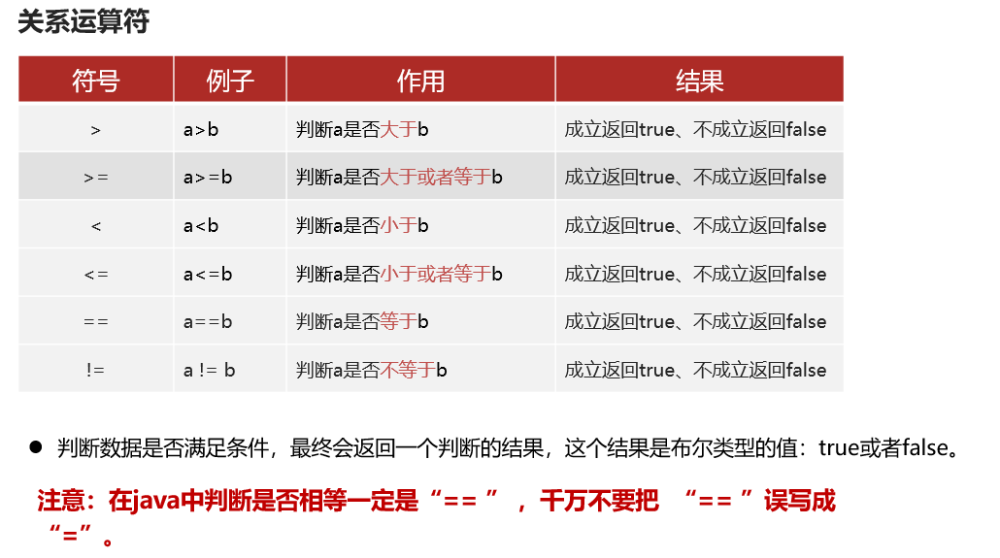


- 判断条件结果为boolean值：true或false，不是1/0

### 逻辑运算符

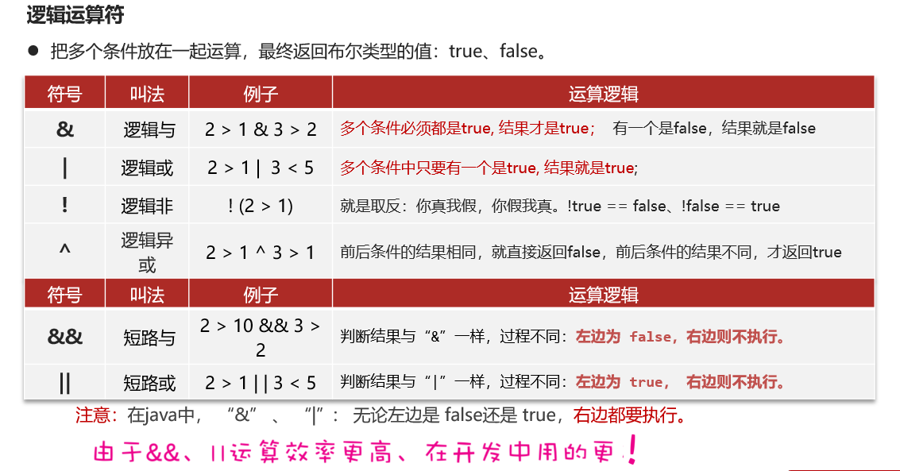


- &&、||更常用，因为其效率更高


###  ?: 三元运算符


- ?:的三元只能是表达式，表达式中可以继续嵌套 ?:

### 运算符优先级


- 1~14 优先级越来越低

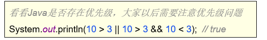

- && 的优先级大于 ||

## API


```
https://www.oracle.com/java/technologies/javase-jdk17-doc-downloads.html
```

### Scanner


- 接收double文件是nextDouble();
- 接收String文件是next();


- 遇到nextInt()时，需要输入一个整数再回车才能进行下一步

```java
package com.heima.scanner;
import java.util.Scanner;

public class demo {
    public static void main(String[] args) {
        Scanner read = new Scanner(System.in);
        int a = read.nextInt();
        System.out.println(a+1);
    }
}
```

- Scanner是自带的包java.lang中的，直接在main函数中输入Scanner会自动import java.util.Scanner，不用手动导包


## 总结


# 流程控制


## 分支结构

### if


```java
package com.heima.branch;

public class demo {
    public static void main(String[] args) {
        //if
        double t = 38.9;
        if (t > 37) {
            System.out.println("Warning");
        }
        //if-else
        double money = 98;
        if (money > 90) {
            System.out.println("OK");
        } else {
            System.out.println("False");
        }
        //if-else if-else
        double score = 95;
        if (score >= 90 && score <= 100) {
            System.out.println("A");
        } else if (score >= 80) {
            System.out.println("B");
        } else if (score >= 70) {
            System.out.println("C");
        } else if (score >= 60) {
            System.out.println("D");
        } else if (score >= 0) {
            System.out.println("E");
        } else {
            System.out.println("Error");
        }
    }
}
```


### switch


- switch性能较高，不需要顺序判断下来，可以直接定位的对应分支
- 单个case的执行代码可以有多行

```java
package com.heima.branch;

public class demo2 {
    public static void main(String[] args) {
        String day = "周三";
        switch (day) {
            case "周一":
                System.out.println("BUG");
                break;
            case "周二":
                System.out.println("HELP");
                break;
            case "周三":
                System.out.println("EAT");
                break;
            case "周四":
                System.out.println("HELP");
                break;
            case "周五":
                System.out.println("GAME");
                break;
            case "周六":
                System.out.println("LOVE");
                break;
            case "周日":
                System.out.println("WORK");
                break;
            default:
                System.out.println("输入的信息有误");
        }
    }
}
```


#### 注意事项


- 支持byte short int char String 枚举
- double默认运算不精确，不好判断等于哪个值
- 不能用变量作为case的值，因为变量的值可能会不断变化
- 穿透现象：执行完该条分支后还会不跳出继续判断下面的分支
- 不写break则继续判断下去，可能执行多条语句


- 有以下两种写法

```java
package com.heima.branch;

public class demo3 {
    public static void main(String[] args) {
        String day = "周三";
        switch (day) {
            case "周一":
                System.out.println("BUG");
                break;
            case "周二", "周三", "周四":
                System.out.println("HELP");
                break;
            case "周五":
                System.out.println("CODE");
                break;
            case "周六", "周日":
                System.out.println("GAME");
                break;
            default:
                System.out.println("输入的信息有误");
        }
    }
}
```

```java
package com.heima.branch;

public class demo3 {
    public static void main(String[] args) {
        String day = "周三";
        switch (day) {
            case "周一":
                System.out.println("BUG");
                break;
            case "周二":
            case "周三":
            case "周四":
                System.out.println("HELP");
                break;
            case "周五":
                System.out.println("CODE");
                break;
            case "周六":
            case "周日":
                System.out.println("GAME");
                break;
            default:
                System.out.println("输入的信息有误");
        }
    }
}
```


## 循环结构

### for


- i的作用域只在for循环内

```java
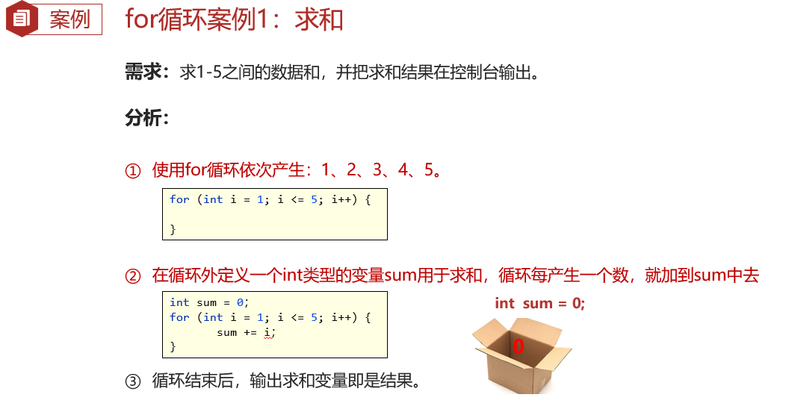package com.heima.loop;


public class demo1 {
    public static void main(String[] args) {
        for (int i = 0; i < 5; i++) {
            System.out.println("hello,world");
        }
    }
}
```


```java
for(int i = 0; i < 100; i ++){
  System.out.println(i);
}
```

#### 案例


```java
package com.heima.loop;

public class demo2 {
    public static void main(String[] args) {
        int sum = 0;
        for (int i = 0; i < 5; i++) {
            sum+=i+1;
        }
        System.out.println(sum);
    }
}
```


```java
package com.heima.loop;

public class demo2 {
    public static void main(String[] args) {
        int sum1 = 0;
        for (int i = 1; i <= 100; i++) {
            if (i % 2 == 1) {
                sum1+=i;
            }
        }
        System.out.println(sum1);
    }
}

```


```java
package com.heima.loop;

public class demo2 {
    public static void main(String[] args) {
        int sum2 = 0;
        for (int i = 1; i <= 100; i+=2) {
                sum2+=i;
        }
        System.out.println(sum2);
    }
}
```


```java
package com.heima.loop;

import static java.lang.Math.pow;

public class demo2 {
    public static void main(String[] args) {
        int count = 0;
        for (int i = 100; i < 1000; i++) {
            if(pow(i%10,3)+pow(i/10%10,3)+pow(i/10/10%10,3)==i){
                System.out.println(i);
                count++;
            }
        }
        System.out.println("总数为："+count);
    }
}
```


### while


```java
package com.heima.loop;

public class demo3 {
    public static void main(String[] args) {
        int i = 0;
        while(i<5){
            System.out.println("hello,world");
            i++;
        }
    }
}

```


#### 案例


```java
package com.heima.loop;

public class demo4 {
    public static void main(String[] args) {
        int count = 0;
        double now = 0.1;
        while(now<8848860) {
            now *= 2;
            count++;
        }
        System.out.println(count);
    }
}
```


### do-while


- 先执行代码后判断条件，效率更高

```java
package com.heima.loop;

public class demo5 {
    public static void main(String[] args) {
        int i = 0;
        do{
            System.out.println("hello,world");
            i++;
        }while(i<5);
    }
}
```

### 三种循环对比


### 死循环


- 服务器需要一直运行
- 还是以while(true)的使用为主，因为死循环运行无数次

```java
package com.heima.loop;

public class demo6 {
    public static void main(String[] args) {
        /*for(;;){
            System.out.println("hello");
        }*/
        while(true){
            System.out.println("hello");
        }
        /*do{
            System.out.println("hello");
        }while(true);*/
    }
}
```


### 嵌套循环

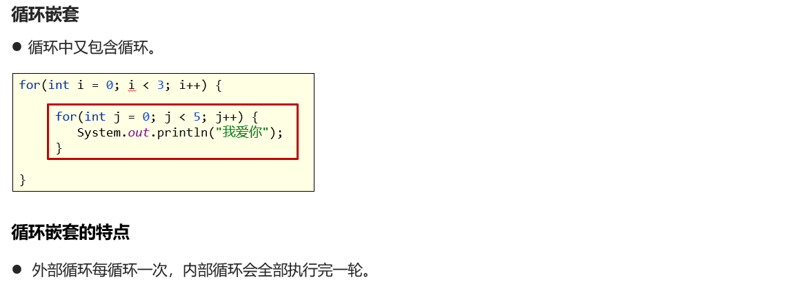

```java
package com.heima.loop;

public class demo8 {
    public static void main(String[] args) {
        for (int i = 0; i < 3; i++) {
            for (int j = 0; j < 5; j++) {
                System.out.println("love you");
            }
        }
    }
}
```

#### 案例


```java
package com.heima.loop;

public class demo8 {
    public static void main(String[] args) {
        for (int i = 0; i < 4; i++) {
            System.out.println("*****");
        }
    }
}
```

```java
package com.heima.loop;

public class demo8 {
    public static void main(String[] args) {
        for (int i = 0; i < 4; i++) {
            for (int j = 0; j < 100; j++) {
                System.out.print("*");
            }
            System.out.println();
        }
    }
}
```

- System.out.print("xxx");输出xxx内容后不换行
- System.out.println();括号内为空则直接输出换行符 \n ,print不能这样用

### 跳转关键字 break/while


- break可以不在循环中用（在switch分支中）

```java
package com.heima.loop;

public class demo8 {
    public static void main(String[] args) {
        for (int i = 0; i < 5; i++) {
            if(i == 3)  break;
            System.out.println("love you");
        }
        System.out.println();
        for (int i = 0; i < 5; i++) {
            if(i == 3)  continue;
            System.out.println("love you");
        }
    }
}
```

#### 案例


```java
package com.heima.loop;

import java.util.Scanner;

public class demo8 {
    public static void main(String[] args) {
        Scanner read = new Scanner(System.in);
        while (true) {
            int number = read.nextInt();
            if (number != 520) {
                System.out.println("密码错误");
                continue;
            } else {
                System.out.println("密码正确，欢迎进入系统");
                break;
            }
        }
    }
}
```

### 生成随机数与其案例

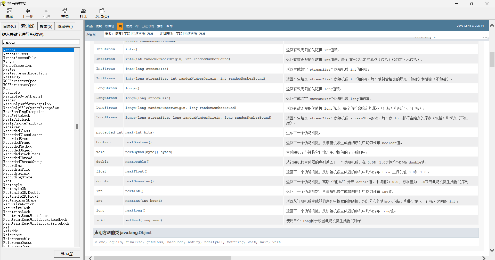

- 可以在中文文档的索引中搜索关键词


```java
package com.heima.random;

import java.util.Random;

public class demo1 {
    public static void main(String[] args) {
        //0-某数的区间随机数
        Random rand = new Random();
        for (int i = 0; i < 10; i++) {
            int number = rand.nextInt(10);  //生成0-9之间的随机数
            System.out.println(number);
        }
    }
}
```


```java
package com.heima.random;

import java.util.Random;

public class demo1 {
    public static void main(String[] args) {
        Random rand = new Random();
        //指定区间随机数
        for (int i = 0; i < 10; i++) {
            int number = rand.nextInt(9) + 1;  
            //生成1-9之间的随机数,即(0~8)+1
            System.out.println(number);
        }
    }
}
```

- 想生成2-10之间的数，就生成0-8之间的数再+2，即rand.nextInt(9)+2

```java
package com.heima.random;

import java.util.Random;

public class demo1 {
    public static void main(String[] args) {
        Random rand = new Random();
        //指定区间随机数
        for (int i = 0; i < 10; i++) {
            int number = rand.nextInt(1,10);  
            //生成1-9之间的随机数
            System.out.println(number);
        }
    }
}
```

- 也可写成nextInt(1,10)即1~9，不包括10


#### 案例


```java
package com.heima.random;

import java.util.Random;
import java.util.Scanner;

public class demo2 {
    public static void main(String[] args) {
        Random rand = new Random();
        int end = rand.nextInt(100) + 1;
        Scanner read = new Scanner(System.in);
        while(true){
            int number = read.nextInt();
            if(number > end){
                System.out.println("too big");
            } else if (number<end) {
                System.out.println("too small");
            }else {
                System.out.println("win");
                break;
            }
        }
    }
}
```

## 总结


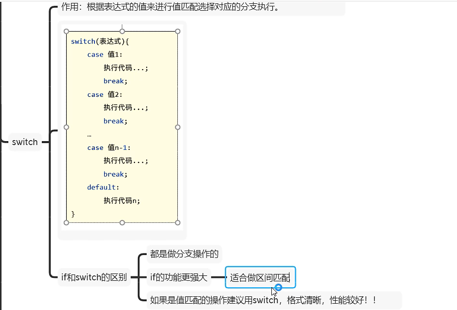


# 数组


## 定义和访问

### 静态初始化数组


- 静态：直接赋值
- int[] a可以一眼看出来是数组类型，建议[]放前面

```java
package com.heima.define;

public class demo1 {
    public static void main(String[] args) {
        int[] a = new int[]{12, 15, 24};
        int[] b = {15, 25, 65};
    }
}
```


- 整个堆区数组称为一个数组对象，0/1/2为索引

```java
int[] a = new int[]{12, 15, 24};
int[] b = {15, 25, 65};
System.out.println(a);
System.out.println(b);
```

```java
[I@7ef20235
[I@27d6c5e0
```

- 输出数组名会输出数组的内存地址，I开头代表是int类型的数组，@后面为十六进制的内存地址


#### 数组的访问


- 数组的最大索引为a.length-1，最后一个元素为a[a.length-1]
- a.length代表数组长度

```java
package com.heima.define;

public class demo2 {
    public static void main(String[] args) {
        int[] a ={112,55,489};
        System.out.println(a[0]);
        System.out.println(a[1]);
        System.out.println(a[2]);
        System.out.println(a.length);

        a[0] = 100;
        a[2] = 500;
        System.out.println(a[0]);
        System.out.println(a[1]);
        System.out.println(a[2]);
    }
}
```

```java
112
55
489
3
100
55
500
```


   

- 数组索引越界异常，索引超过最大索引时会出现


#### 数组的遍历


- 一个个数据依次访问

```java
package com.heima.define;

public class demo3 {
    public static void main(String[] args) {
        int[] a = {100,200,300,400,500};
        for (int i = 0; i < a.length; i++) {
            System.out.println(a[i]);
        }
    }
}
```

```java
package com.heima.define;

public class demo3 {
    public static void main(String[] args) {
        int[] a = {100,200,300,400,500};
        for (int i : a) {
            System.out.println(i);
        }
    }
}
```

- 简写遍历的方法 for(int i : a){}

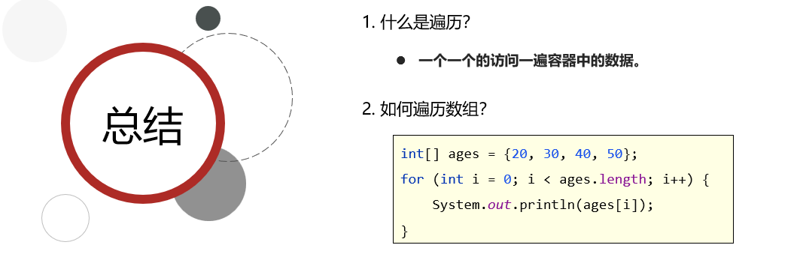

#### 案例


```java
package com.heima.define;

public class demo4 {
    public static void main(String[] args) {
        int sum = 0;
        int[] money = {16, 26, 36, 6, 100};
        for (int i = 0; i < money.length; i++) {
            sum += money[i];
        }
        System.out.println(sum);
    }
}
```

### 动态初始化数组


```java
package com.heima.define;

public class demo5 {
    public static void main(String[] args) {
        int n = 100;
        int[] a = new int[n];
        int[] b = new int[10];
        System.out.println(a[0]);
        System.out.println(a[1]);
        System.out.println(a[n - 1]);
        a[0] = 100;
        System.out.println(a[0]);
    }
}
```

```java
0
0
0
100
```


```java
package com.heima.define;

public class demo5 {
    public static void main(String[] args) {
        byte[] a1 = new byte[5];
        short[] a2 = new short[5];
        int[] a3 = new int[5];
        long[] a4 = new long[5];
        char[] a5 = new char[5];
        System.out.println(a1[0]);
        System.out.println(a2[0]);
        System.out.println(a3[0]);
        System.out.println(a4[0]);
        System.out.print(a5[0]);
        System.out.println((int)a5[0]);
        float[] a6 = new float[5];
        double[] a7 = new double[5];
        System.out.println(a6[0]);
        System.out.println(a7[0]);
        boolean[] a8 = new boolean[5];
        System.out.println(a8[0]);
        String[] a9 = new String[5];
        System.out.println(a9[0]);
    }
}
```

```java
0
0
0
0
 0
0.0
0.0
false
null
```

- char的默认值为 空格 ，(int)char[0]为0


#### 案例


```java
package com.heima.define;

import java.util.Scanner;

public class demo6 {
    public static void main(String[] args) {
        double[] a = new double[6];
        Scanner read = new Scanner(System.in);
        double sum = 0;
        for (int i = 0; i < a.length; i++) {
            a[i] = read.nextDouble();
            sum+=a[i];
        }
        double ave = sum/a.length;
        System.out.println(ave);
    }
}
```


```java
package com.heima.define;

import java.util.Scanner;

public class demo6 {
    public static void main(String[] args) {
        Scanner read = new Scanner(System.in);
        int count = 0;
        double[] score = new double[6];
        for (int i = 0; i < score.length; i++) {
            score[i] = read.nextDouble();
            if(score[i]>=60)   {
                count++;
            }
        }
        System.out.println(count);
    }
}
```


## 数组在计算机中的执行原理


- 方法区加载.class文件（字节码文件），栈内存存储方法，以及方法中的变量（基本数据类型）和数组地址值（引用数据类型），堆内存存储数组（引用数据类型）


- 改变其中一个数组的元素另一个数组的元素也会改变，两者同步更改，因为两个数组公用一片内存，内存地址相同

```java
package com.heima.memory;

public class demo2 {
    public static void main(String[] args) {
        int[] a1 = {11,22,33};
        int[] a2 = a1;
        System.out.println(a1);
        System.out.println(a2);
        System.out.println(a1[2]);
        System.out.println(a2[2]);
        a2[2] = 55;
        a1[1] = 44;
        System.out.println(a1[2]);
        System.out.println(a2[1]);
    }
}
```

```java
[I@7ef20235
[I@7ef20235
33
33
55
44
```


- arr2赋值null后，不再指向任何堆内存中的数组对象，索引不存在，length也不存在
- 输出arr2会输出null

```java
package com.heima.memory;

public class demo3 {
    public static void main(String[] args) {
        int[] a1 = {11,22,33};
        int[] a2 = a1;
        System.out.println(a2);
        a2 = null;
        System.out.println(a2);
    }
}
```

```java
[I@7ef20235
null
```


## 案例


```java
package com.heima.memory;

public class demo4 {
    public static void main(String[] args) {
        int[] score = {15,9000,10000,20000,9500,-5};
        int max = score[0];
        for (int i = 1; i < score.length; i++) {
            if(score[i]>=max) {
                max = score[i];
            }
        }
        System.out.println(max);
    }
}
```


```java
package com.heima.memory;

public class demo4 {
    public static void main(String[] args) {
        int[] a = {10,20,30,40,50};
        /*for (int i = 0; i < a.length / 2; i++) {
            int temp = a[i];
            a[i] = a[a.length - 1 - i];
            a[a.length - 1 - i] = temp;
        }*/
        for (int i = 0, j = a.length - 1; i < j; i++, j--) {
            int temp = a[i];
            a[i] = a[j];
            a[j] = temp;
        }
        /*for (int i = 0; i < a.length; i++) {
            System.out.println(a[i]);
        }*/
        for (int i : a) {
            System.out.println(i);
        }
        //不能写成println(a[i]),会表现为a[10],a[20],...
    }
}
```

- for(int i : a){} 时，i 为 a 中的元素 a[i] 的赋值 而非 索引i ，此时i只是被a[i]赋值，i的值的改变不会影响a[i]的值，只有在输出的时候才这样用
- 在for中同时使用两个变量i，j可以更简洁，for语句中循环变量支持多个

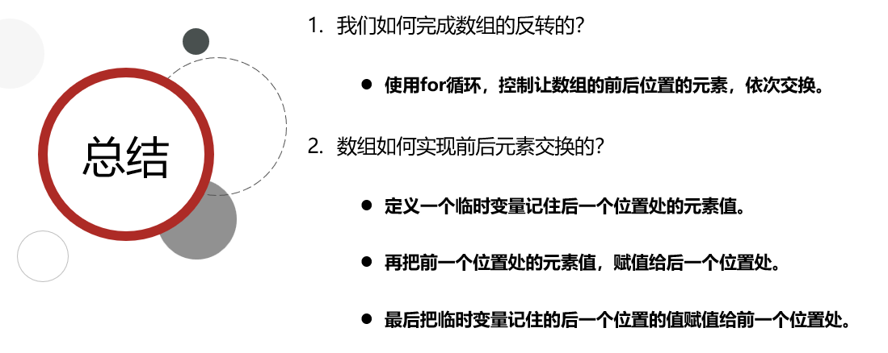


```java
package com.heima.memory;

import java.util.Random;
import java.util.Scanner;

public class demo4 {
    public static void main(String[] args) {
        int[] id = new int[5];
        Scanner read = new Scanner(System.in);
        for (int i = 0; i < id.length; i++) {
            id[i] = read.nextInt();
        }
        Random rand = new Random();
        for (int i = 0; i < id.length; i++) {
            int index = rand.nextInt(id.length);
            int temp = id[i];
            id[i] = id[index];
            id[index] = temp;
        }
        for (int i : id) {
            System.out.println(i);
        }
    }
}
```


## 总结


# 方法


- 方法内可以调用自身方法或其他方法，不能定义方法
- 方法的顺序不影响方法的调用，即在同一文件中先定义的方法可以调用下面后定义的方法

```java
package com.heima.define;

public class demo1 {
    public static void main(String[] args) {
        int rs1 = sum(10, 20);
        int rs2 = sum(30, 20);
        System.out.println(rs1);
        System.out.println(rs2);
    }

    public static int sum(int a, int b) {
        int c = a + b;
        return c;
    }
}
```


- ↑箭头为跳出当前调试步骤所在的方法


## 方法的其他形式


- void类型的方法，方法内部没有返回值，无需使用return

```java
package com.heima.define;

public class demo2 {
    public static void main(String[] args) {
        printHelloWorld();
        printHelloN(5);

    }

    public static void printHelloWorld(){
        for (int i = 0; i < 3; i++) {
            System.out.println("hello,world");
        }
        return ; //return ;可以省略
    }
    public static void printHelloN(int n){
        for (int i = 0; i < n; i++) {
            System.out.println("hello,world");
        }
    }
}
```


## 常见问题


- 方法调用时实参和形参要类型一 一对应，不能漏传、错传
- 变量名可以和方法名相同
- sum(1,2); 单行语句产生的值无法调用，但仍会运行代码

```java
package com.heima.define;

public class demo3 {
    public static void main(String[] args) {
        int sum = sum(1,2);
        System.out.println(sum);

        System.out.println(sum(1,2));
        
        sum(1,2);
        
        hello();
    }
    public static int sum(int a,int b){
        int c = a+b;
        return c;
    }
    public static void hello(){
        System.out.println("hello");
    }
}
```

## 案例


```java
package com.heima.example;

import java.util.Scanner;


public class demo1 {
    public static void main(String[] args) {
        Scanner read = new Scanner(System.in);
        int n = read.nextInt();
        int s = sum(n);
        System.out.println(s);
    }
    public static int sum(int n){
        int s = 0;
        for (int i = 1; i <= n; i++) {
            s+=i;
        }
        return s;
    }
}
```


```java
package com.heima.example;

import java.util.Scanner;

public class demo2 {
    public static void main(String[] args) {
        Scanner read = new Scanner(System.in);
        int x = read.nextInt();
        check(x);
    }
    public static void check(int x){
        if(x%2==1){
            System.out.println(x+"为偶数");
        }
        else{
            System.out.println(x+"为奇数");
        }
    }
}
```


## 在计算机中的执行原理


- 保证最终可以回到main方法，其他的方法可以及时释放防止溢出，用时入栈，用完出栈


- main入栈-sum入栈-sum出栈-main出栈


- main入栈-study入栈-eat入栈-eat出栈-sleep入栈-sleep出栈-study出栈-main出栈


## 参数传递机制

### 值传递

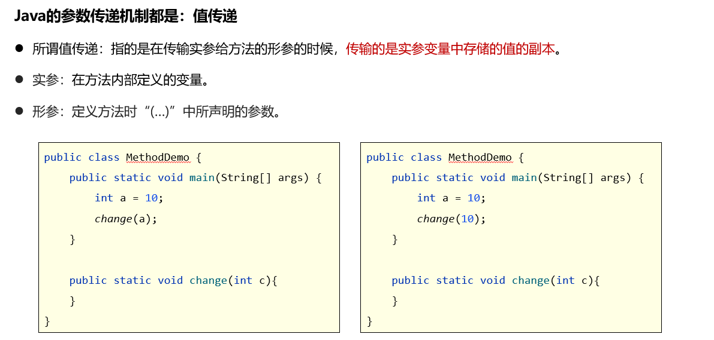


- 方法中的a为副本，为形参，其发生变化时不影响实参的变化

```java
package parameter;

public class demo1 {
    public static void main(String[] args) {
        int a = 10;
        change(10);
        System.out.println(a);  //10
    }
    public static void change(int a){
        System.out.println(a);  //10
        a = 20;
        System.out.println(a);  //20
    }
}
```


### 引用传递


- 当参数为引用类型时，会把引用对象的地址传给方法，在方法内改变引用对象，方法外也会改变
- 也是值传递，传递的值为地址

```java
package parameter;

public class demo2 {
    public static void main(String[] args) {
        int[] a = {11,22,33};
        change(a);
        System.out.println(a[1]);
    }
    public static void change(int[] a){
        System.out.println(a[1]);
        a[1] = 55;
        System.out.println(a[1]);
    }
}
```


#### 案例

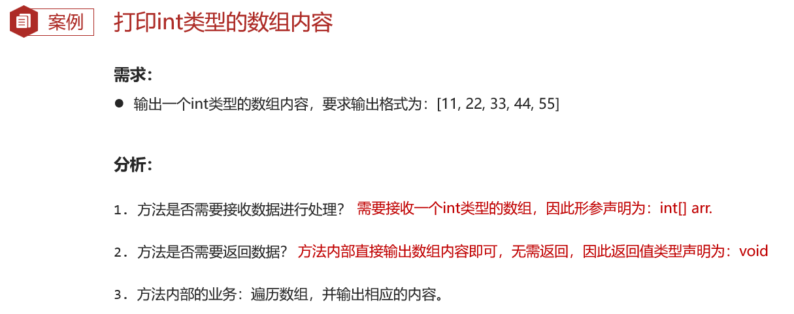

```java
package parameter;

import java.util.Scanner;

public class demo3 {
    public static void main(String[] args) {
        int[] a = new int[10];
        Scanner read = new Scanner(System.in);
        for (int i = 0; i < 10; i++) {
            a[i] = read.nextInt();
        }
        printArray(a);

        int[] b = null;
        printArray(b);
        
        int[] c = {};
        printArray(c);
    }
    public static void printArray(int[] a){
        if(a==null){
            return;
        } 
        System.out.print("[");
        for (int i = 0; i < a.length; i++) {
            /*if(i!=a.length-1){
                System.out.print(a[i]+",");
            }else {
                System.out.print(a[i]);
            }*/
            System.out.print((i!=a.length-1)?(a[i]+","):a[i]);
        }
        System.out.print("]");
    }
}

```

- 考虑多种情况，数组为null和数组中没有元素，是两种情况，数组中没有元素时依旧会输出 [] ,null的时候会直接跳出循环
- 数组中没有元素但是依然会开辟一块地址，输出c也会输出c的地址


```java
package parameter;

public class demo4 {
    public static void main(String[] args) {
        int[] a1 = {11,22,33};
        int[] a2 = {11,22,33};
        System.out.println(check(a1,a2));
    }
    public static boolean check(int[]a1,int[]a2){
        if(a1==null&&a2==null){
            return true;
        }
        if(a1==null||a2==null){
            return false;
        }
        if(a1.length!=a2.length){
            return false;
        }
        for (int i = 0; i < a1.length; i++) {
            if(a1[i]!=a2[i]){
                return false;
            }
        }
        return true;
    }
}

```

- 使用了卫语句，层层拦截了非法的情况，一步步if限制情况，防止多层嵌套if-else，代码风格优雅


```java
package com.heima.parameter;

import java.util.Scanner;

public class demo5 {
    public static void main(String[] args) {
        Scanner read = new Scanner(System.in);
        int n = read.nextInt();
        int[] a = new int[n];
        for (int i = 0; i < n; i++) {
            a[i] = read.nextInt();
        }
        if(a == null || a.length == 0){
            System.out.println("最大值不存在");
        }else{
            System.out.println("max = "+max(a));
        }
    }
    public static int max(int[] a){
        int max = a[0];
        for(int i: a){
            if(i > max){
                max = i;
            }
        }
        return max;
    }
}
```


```java
package com.heima.parameter;

public class demo6 {
    public static void main(String[] args) {
        int[] a = {11,22,33};

    }
    public static int search(int[] a,int x){
        int index = -1;
        for (int i = 0; i < a.length; i++) {
            if(a[i] == x){
                index = i;
                return index;
            }
        }
        return index;
    }
}
```


## 方法重载


- 一个形参是int a，一个形参是int b不是重载，会报错
- 一个去掉public static 修饰符，一个带着，不算重载，会报错
- int a,double b和doule b,int a是重载，不一样，前后两个形参的类型不同

```java
package com.heima.overload;

public class demo1 {
    public static void main(String[] args) {
        test();
        test(100);
    }
    public static void test(){
        System.out.println(1);
    }
    public static void test(int a){
        System.out.println(2);
    }
    public static void test(int a,int b){
        System.out.println(3);
    }
    public static void test(int a,double b){
        System.out.println(4);
    }
    public static void test(double a,int b){
        System.out.println(5);
    }
    public static void test(double a){
        System.out.println(6);
    }
}
```


```java
package com.heima.overload;

public class demo2 {
    public static void main(String[] args) {
        fire();
        fire("岛国");
        fire("米国",10);
    }
    public static void fire(){
        System.out.println("fire(one to dao)");
    }
    public static void fire(String country){
        System.out.println("fire(one to)"+country);
    }
    public static void fire(String country,int num){
        System.out.println("fire "+num+" to "+country);
    }
}
```


## return的使用


- 该用法只能用在void型的方法中

```java
package com.heima.rt;

public class demo {
    public static void main(String[] args) {
        chu(1,0);
    }
    public static void chu(int a,int b){
        if(b == 0){
            System.out.println("错误");
            return ;
        }
        double c = 1.0*a/b;
        System.out.println(c);
    }
}

```


## 总结


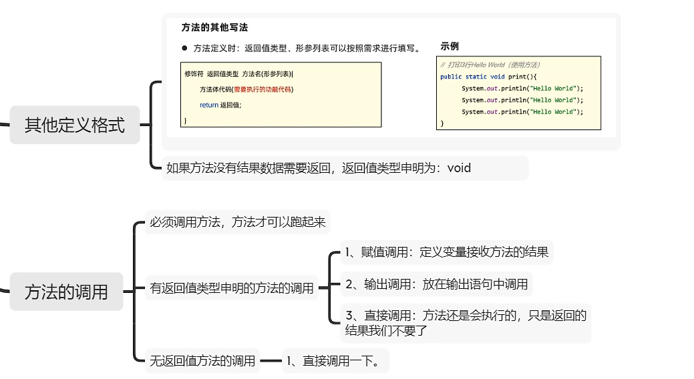


    


# 案例


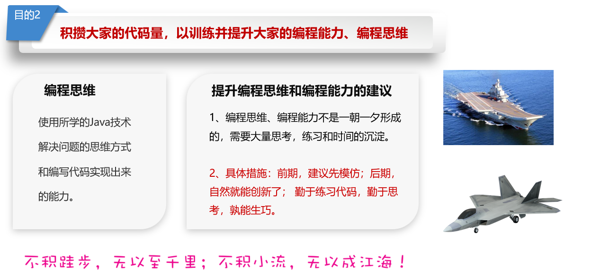

## 案例1


```java
package com.heima;

import java.util.Scanner;

public class demo1 {
    public static void main(String[] args) {
        Scanner read = new Scanner(System.in);
        int month = read.nextInt();
        double money = read.nextDouble();
        String type = read.next();
        if (type == "头等舱" || type == "经济舱") {
            System.out.println("输入的机票类型错误");
            return;
        }
        System.out.println("优惠后的价格为：" + calculate(month, money, type));
    }

    public static double calculate(int month, double money, String type) {
        /*if (month >= 5 && month <= 10) {
            if (type == "头等舱") {
                return money * 0.9;
            }
            else {
                return money * 0.85;
            }
        }
        else {
            if (type == "头等舱") {
                return money * 0.7;
            }
            else {
                return money * 0.65;
            }
        }
        return -1;*/
        if (month >= 5 && month <= 10) {
            switch(type){
                case "头等舱":
                    money*=0.9;
                    break;
                case "经济舱":
                    money*=0.85;
                    break;
            }
        }
        else {
            switch(type){
                case "头等舱":
                    money*=0.7;
                break;
                case "经济舱":
                    money*=0.65;
                    break;
            }
        }
        return money;
    }
} 
```

- 不建议在方法中的if/switch分支中添加return语句，否则会报错，需要在方法的最后一行添加return语句
- 如果方法中只有if-else，或者switch中包含case与default，即包含所有情况下，此时return可以在分支内

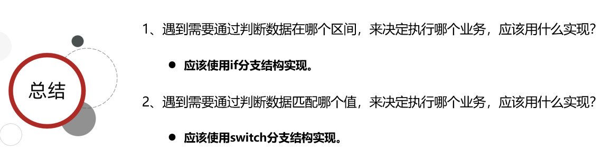

## 案例2


```java
package com.heima;

import java.util.Random;
import java.util.Scanner;

public class demo2 {
    public static void main(String[] args) {
        Scanner read = new Scanner(System.in);
        int n = read.nextInt();
        System.out.println(createCode(n));
    }

    public static String createCode(int n) {
        Random rand = new Random();
        String code = "";
        for (int i = 0; i < n; i++) {
            int type = rand.nextInt(3); //0~2
            switch (type) {
                case 0:
                    code += rand.nextInt(10);  //0~9 +连接符连接字符和数字
                    //code+=(char)rand.nextInt(10)+45;
                    break;
                case 1:
                    code += (char) rand.nextInt((int) 'a', (int) 'z' + 1);  //97~97+25
                    //code+=(char)rand.nextInt(26)+97;
                    break;
                default:
                    code += (char) rand.nextInt((int) 'A', (int) 'Z' + 1);  //65~65+25
                    //code+=(char)rand.nextInt(26)+65;
                    break;
            }
        }
        return code;
    }
}
```

- 空字符串为""，不是null，null指向空地址，null的话再接受数据还会保留null，会重新开辟地址空间，输出字符串会是nullxxx


## 案例3


```java
package com.heima;

import java.util.Scanner;

public class demo3 {
    public static void main(String[] args) {
        Scanner read = new Scanner(System.in);
        int n = read.nextInt(); //默认n>2
        double[] score = new double[n];
        score[0] = read.nextDouble();
        double max = score[0], min = score[0];
        double sum = score[0];
        for (int i = 1; i < n; i++) {
            score[i] = read.nextDouble();
            sum += score[i];
            if (score[i] > max) {
                max = score[i];
            }
            if (score[i] < min) {
                min = score[i];
            }
        }
        sum -= max + min;
        sum /= (n - 2);
        System.out.println(sum);
    }
}
```


## 案例4


```java
package com.heima;

import java.util.Scanner;

public class demo4 {
    public static void main(String[] args) {
        Scanner read = new Scanner(System.in);
        String code = read.next();
        int[] num = new int[4];
        for (int i = 0; i < 4; i++) {
            num[i] = (int)(code.charAt(i)-'0');
            num[i] += 5;
            num[i] %= 10;
        }
        for (int i = 0,j = num.length-1; i < j; i++,j--) {
            int temp = num[i];
            num[i] = num[j];
            num[j] = temp;
        }
        code = "";
        for (int i = 0; i < 4; i++) {
            code+=num[i];
        }
        System.out.println(code);
    }
}
```

```java
package com.heima;

import java.util.Scanner;

public class demo4 {
    public static void main(String[] args) {
        Scanner read = new Scanner(System.in);
        int number = read.nextInt();
        int[] num = spilit(number);
        for (int i = 0; i < num.length; i++) {
            num[i] += 5;
            num[i] %= 10;
        }
        reverse(num);
        for (int i : num) {
            System.out.print(i);
        }
    }
    public static int[] spilit(int number) {
        int[] num = new int[4];
        for (int i = 0; i < 4; i++) {
            num[3-i] = number%10;
            number/=10;
        }
        return num;
    }
    public static void reverse(int[] num) {
        for (int i = 0,j = num.length-1; i < j; i++,j--) {
            int temp = num[i];
            num[i] = num[j];
            num[j] = temp;
        }
    }
}
```

- 第二种方法没用String，第一种用了
- 数组可以作为方法的返回类型，return+数组名 可以 返回数组的地址


- 该程序加密程序和解密程序代码相同，因为+5%10了两次有反转了两次就回到原来的数了


## 案例5


- 不能直接赋值地址，否则在实际上还是同一个数组

```java
package com.heima;

public class demo5 {
    public static void main(String[] args) {
        int[] a1 = {11,22,33,44,55};
        int[] a2 = copy(a1);
        printArray(a2);
    }
    public static void printArray(int[] a2) {
        System.out.print("[");
        for (int i = 0; i < a2.length; i++) {
            System.out.print((i != a2.length - 1) ? (a2[i] + ",") : a2[i]);
        }
        System.out.print("]");
    }
    private static int[] copy(int[] a1) {
        int[] a2 = new int[a1.length];
        for (int i = 0; i < a1.length; i++) {
            a2[i] = a1[i];
        }
        return a2;
    }
}
```


## 案例6


```java
package com.heima;

import java.util.Random;
import java.util.Scanner;

public class demo6 {
    public static void main(String[] args) {
        int[] money = {9,666,188,520,999999};
        Scanner read = new Scanner(System.in);
        while(check(money)){
            System.out.println("start: ");
            String start = read.next();
            delete(money);
        }
        /*for (int i = 0; i < money.length; i++) {
            System.out.println("start: ");
            String start = read.next();

            Random rand = new Random();
            int n = rand.nextInt(money.length);

            if(money[n]!=0){
                System.out.println("get "+money[n]);
                money[n]=0;
            }
            else{
                while(money[n]==0){
                    n = rand.nextInt(money.length);
                }
                System.out.println("get "+money[n]);
                money[n]=0;
            }
        }*/
        System.out.println("end");
    }
    public static void delete(int[] money) {
        Random rand = new Random();
        int n = rand.nextInt(money.length);
        if(money[n]==0){
            delete(money);
        }
        else{
            System.out.println("get "+money[n]);
            money[n]=0;
        }
    }
    public static boolean check(int[] money) {
        for (int i = 0; i < money.length; i++) {
            if(money[i] != 0){
                return true;
            }
        }
        return false;
    }
}

```

- 可以在方法中调用自身方法或其他方法


- 方法2结果也是随机，但效率更高

```java
package com.heima;

import java.util.Random;
import java.util.Scanner;

public class demo6_1 {
    public static void main(String[] args) {
        int[] money = {9,666,188,520,999999};
        Scanner read = new Scanner(System.in);
        change(money);
        for (int i = 0; i < money.length; i++) {
            System.out.println("start");
            String start = read.next();
            System.out.println(money[i]);
        }
        System.out.println("end");
    }
    public static void change(int[] money) {
        Random rand = new Random();
        for (int i = 0; i < money.length; i++) {
            int x = rand.nextInt(money.length);
            int temp = money[i];
            money[i] = money[x];
            money[x] = temp;
        }
    }
}
```


## 案例7


- 1不是素数

```java
package com.heima;

public class demo7 {
    public static void main(String[] args) {
        int count = 0;
        for (int i = 101; i < 201; i++) {
            boolean flag = true;
            if(i==1)    flag = false;
            for (int j = 2 ;j <= i/2; j++) {
                if(i%j==0) {
                    flag = false;
                    break;
                }
            }
            if(flag){
                System.out.println(i);
                count++;
            }
        }
        System.out.println("总数为"+count);
}
```

- boolean flag 为信号位思想，用flag接收不同的信号用于判断下一步的操作

```java
package com.heima;

public class demo7_1 {
    public static void main(String[] args) {
        int count = 0;
        OUT:
        for (int i = 101; i < 201; i++) {
            boolean flag = true;
            if(i==1)    flag = false;
            for (int j = 2 ;j <= i/2; j++) {
                if(i%j==0) {
                    flag = false;
                    continue OUT;
                }
            }
            if(flag){
                System.out.println(i);
                count++;
            }
        }
        System.out.println("总数为："+count);
    }
}
```

- 使用标签的方法结束外部循环，类似于C语言中的FLAG: + goto，标签名可以随意起，continue OUT; 代表结束当前循环执行外部for循环中的下一次循环

```java
package com.heima;

public class demo7 {
    public static void main(String[] args) {
        int count = 0;
        for (int i = 101; i < 201; i++) {
            if(isNum(i)){
                System.out.println(i);
                count++;
            }
        }
        System.out.println("总数为"+count);
    }
    public static boolean isNum(int i) {
        if(i==1)    return false;
        for (int j = 2 ;j <= i/2; j++) {
            if(i%j==0)  return false;
        }
        return true;
    }
}

```

- 使用多个方法可以提高效率，是代码更简洁，可读性更高


## 案例8

> 打印九九乘法表

```java
package com.heima;

public class demo8 {
    public static void main(String[] args) {
        for (int i = 1; i <= 9; i++) {
            for (int j = 1; j <= i; j++) {
                System.out.print(i+"*"+j+"="+i*j+" ");
            }
            System.out.println();
        }
    }
}
```

- 先打印行再打印列

## 案例9

> 打印三角形，形式如下

```
    *
   ***
  *****
 *******
*********
```

```java
package com.heima;

import java.util.Scanner;

public class demo9 {
    public static void main(String[] args) {
        Scanner read = new Scanner(System.in);
        int n = read.nextInt();
        for (int i = 1; i <= n; i++) {
            for (int j = 1; j <= n-i; j++) {
                System.out.print(" ");
            }
            for (int j = 1; j <= i*2 - 1; j++) {
                System.out.print("*");
            }
            System.out.println();
        }
    }
}
```

```java
    *
   * *
  * * *
 * * * *
* * * * *
```

```java
package com.heima;

import java.util.Scanner;

public class demo9_1 {
    public static void main(String[] args) {
        Scanner read = new Scanner(System.in);
        int n = read.nextInt();
        for (int i = 1; i <= n; i++) {
            for (int j = 1; j <= n-i; j++) {
                System.out.print(" ");
            }
            for (int j = 1; j <= i*2 - 1; j++) {
                System.out.print((j%2==0)?" ":"*");
            }
            System.out.println();
        }
    }
}
```

## 案例10


```java
package com.heima;

import java.util.Random;
import java.util.Scanner;

public class demo10 {
    public static void main(String[] args) {
        int[] userSelect = userSelectNumbers();
        int[] luckeyNumbers = generateLuckeyNumbers();
        guess(userSelect,luckeyNumbers);
    }
    public static void guess(int[] userSelect, int[] luckeyNumbers) {
        System.out.println("中奖号码为：");
        System.out.print("red: ");
        for (int i = 0;i < 6;i++) {
            System.out.print(luckeyNumbers[i]+" ");
        }
        System.out.println();
        System.out.println("blue: "+luckeyNumbers[6]);

        int flag1 = 0;
        int flag2 = 0;
        for (int i = 0; i < 6; i++) {
            if(userSelect[i] == luckeyNumbers[i]){
                flag1++;
            }
        }
        if(userSelect[6] == luckeyNumbers[6]){
            flag2++;
        }
        if(flag1 == 6&&flag2==1){
            System.out.println("win1");
        } else if (flag1 == 6) {
            System.out.println("win2");
        }else if (flag1 == 5&&flag2==1) {
            System.out.println("win3");
        }else if (flag1 == 5||flag1 == 4&&flag2==1) {
            System.out.println("win4");
        }else if (flag1 == 4||flag1 == 3&&flag2==1) {
            System.out.println("win5");
        } else if (flag2==1) {
            System.out.println("win6");
        } else{
            System.out.println("not win");
        }
    }
    public static int[] generateLuckeyNumbers() {
        int[] number = new int[7];
        Random rand = new Random();
        /*
        //随机打乱33个球，抽前六个球，运行效率更高但代码复杂
        int[] red = new int[33];
        for (int i = 0; i < 33; i++) {
            red[i] = i+1;
        }
        for (int i = 0; i < 33; i++) {
            int flag = rand.nextInt(1,34);  //1~33号
            int temp = red[i];
            red[i] = red[flag];
            red[flag] = temp;
        }
        for (int i = 0; i < 6; i++) {
            number[i] = red[i];
        }*/
        for (int i = 0; i < 6; i++) {
            while(true){
                number[i] = rand.nextInt(1,34);
                if(check(number,i)){
                    break;
                }
            }
        }
        number[6] = rand.nextInt(1,17);     //1~16号
        return number;
    }
    public static int[] userSelectNumbers() {
        int[] number = new int[7];
        Scanner read = new Scanner(System.in);
        //先六红后一蓝
        System.out.print("red: ");
        for (int i = 0; i < 6; i++) {
            while(true){
                number[i] = read.nextInt();
                if(number[i]>33||number[i]<1){
                    System.out.println("该球号码范围不对，请重新输入该球的号码");
                    continue;
                }
                if(check(number,i)){
                    break;
                }else{
                    System.out.println("该球号码重复，请重新输入该球的号码");
                }
            }
        }
        System.out.print("blue: ");
        while(true){
            number[6] = read.nextInt();
            if(number[6]>16||number[6]<1){
                System.out.println("该球号码范围不对，请重新输入该球的号码");
                number[6] = read.nextInt();
            }
            break;
        }
        return number;
    }
    public static boolean check(int[] number, int i) {
        if(i == 0)  return true;
        for (int j = 0; j < i; j++) {
            if(number[i] == number[j]){
                return false;
            }
        }
        return true;
    }
}
```

- 推荐使用多个方法，可以提高效率，且更简洁，可读性更强
- else if在上一条未通过后才会判断，由此可以省略一些已经判断过的条件
- 顺序不影响红球中奖，判断时要考虑到


# 类与对象

## 常量

*在程序运行时是不能被修改的*

*使用 final 关键字来修饰*

*虽然常量名也可以用小写，但为了便于识别，通常使用大写字母表示常量*

```java
final int X = 1;
final double PI = 3.1415926;
```

## 变量

### 局部变量

*定义在方法、构造方法或语句块中的变量，作用域只限于当前方法、构造方法或语句块中。局部变量必须在使用前声明，并且不能被访问修饰符修饰*

```java
public class Main(){
  public static void main(String args[]){
    
  }
  public void fanction(){
    int a = 10;     //局部变量
  }
}
```

### 成员变量/实例变量

- 储存在堆区
- *类生成的每个对象的成员变量是相对独立的*
- *定义在类中、方法之外的变量，作用域为整个类，可以被类中的任何方法、构造方法和语句块访问。成员变量可以被访问修饰符修饰*

```java
public class Main(){
  int a = 10;     //成员变量
  public static void main(String args[]){
    
  }
}
```

### 静态变量/类变量

- 储存在静态存储区，不会遇到垃圾回收
- *类生成的所有对象共享一个静态变量*
- *定义在类中、方法之外的变量，并且使用 static 关键字修饰，作用域为整个类，可以被类中的任何方法、构造方法和语句块访问，静态变量的值在程序运行期间只有一个副本。静态变量可以被访问修饰符修饰*

```java
public class Main(){
  static int a = 10;     //静态变量
  public static void main(String args[]){
    
  }
}
```

### 参数变量

#### 定义

*方法定义时声明的变量，作为调用该方法时传递给方法的值。参数变量的作用域只限于方法内部*

```java
public class Main(){
  public static void main(String args[]){
    
  }
  public void fanction(int a){      //参数变量
    
  }
}
```

#### 传值问题

##### 值传递

*在方法调用时，传递的是实际参数的值的副本。当参数变量被赋予新的值时，只会修改副本的值，不会影响原始值。Java 中的基本数据类型都采用值传递方式传递参数变量的值*

```java
public class Main(){
  static int a = 10;
  public static void main(String args[]){
    change(a);    //a的值并不会发生改变
  }
  public static void change(int x){
    x = 20;
  }
}
```

##### 引用传递

*在方法调用时，传递的是实际参数的引用（即内存地址）。当参数变量被赋予新的值时，会修改原始值的内容。Java 中的对象类型采用引用传递方式传递参数变量的值*

```java
public class Person(){
  static int x = 10;
  public static void main(String args[]){
    Person person = new Person();
    change(person);    
    //person.x的值会改变,且所有Person产生的对象的x的值都改变
  }
  public static void change(Person p){
    p.x = 20;
  }
}
```

## 方法

### 定义

```java
修饰符 返回值类型 方法名(参数类型 参数名){
  方法体
  return 返回值;  //void类型没有返回值,但可用 return; 跳出方法
}
```

```java
public static int change(int a){
  a = a + 3；
  return a;
}
```

### 重载

```java
int max(int a,int b){
  
}
float max(float a,float b){
  
}
```

### 构造方法

```java
class Person{
  int x;
  Person(int temp){
    x = temp;
  }
}
```

### 类方法

*用static修饰，只能操作类变量，不能操作实例变量，可以通过类名或对象名调用，只能调用类方法，不能调用实例方法，不能调使用super、this关键字*

```java
class Person(){
  static int x = 1;
  static void show(){
    System.out.println(x);
  }
}
```

### 实例方法

*能操作类变量和实例变量，只能通过对象名调用，能调用类方法和实例方法，能调使用super、this关键字*

```java
class Person(){
  int x = 1;
  void show(){
    System.out.println(x);
  }
}
```

### 命令行参数

```java

```

### 可变参数

```java

```

### finalize

```java

```

## 包

- *如果一个类定义在某个包中，那么 package 语句应该在源文件的首行*
- *如果源文件包含 import 语句，那么应该放在 package 语句和类定义之间。如果没有 package 语句，那么 import 语句应该在源文件中最前面*
- *import 语句和 package 语句对源文件中定义的所有类都有效。在同一源文件中，不能给不同的类不同的包声明*

一个类可能需要另一个类声明的对象作为自己的成员或方法中的局部变量，如果这两个类
在同一个包中，当然没有问题
如果一个类想要使用的那个类和它不在一个包中，要使用import语句完成使命

<br/>

## 类

- *一个源文件中只能有一个 public 类*
- *一个源文件可以有多个非 public 类*
- *源文件的名称应该和 public 类的类名保持一致*

### 定义

```java
class People{
  
}
```

<br/>

## 对象

### 创建

```java
class People{
  public static void main(String args[]){
    People people = new People();
    /*People people;
    people = new People();*/
    
    People p = people;        //会赋值
  }
}
```

<br/>

## 接口

### 规则

- *一个实现接口的类，必须实现接口内所描述的所有方法，否则就必须声明为抽象类*
- *类在实现接口的方法时，不能抛出强制性异常，只能在接口中，或者继承接口的抽象类中抛出该强制性异常        //？*
- *接口类型可用来声明一个变量，他们可以成为一个空指针，或是被绑定在一个以此接口实现的对象        //？*

#### 与类的相同点

```java
一个接口可以有多个方法
接口文件保存在 .java 结尾的文件中，文件名使用接口名
接口的字节码文件保存在 .class 结尾的文件中
接口相应的字节码文件必须在与包名称相匹配的目录结构中
```

#### 与类的不同点

```java
接口不能用于实例化对象
接口没有构造方法
接口中所有的方法必须是抽象方法，Java8之后接口中可以使用default关键字修饰的非抽象方法
接口中不能含有静态代码块以及静态方法(用 static 修饰的方法)
接口不能包含成员变量，除了 static 和 final 变量
接口不是被类继承了，而是要被类实现
接口支持多继承
```

#### 特性

```java
接口中每一个方法也是隐式抽象的,接口中的方法会被隐式的指定为 public abstract（只能是 public abstract，其他修饰符都会报错）
接口中可以含有变量，但是接口中的变量会被隐式的指定为 public static final 变量（并且只能是 public，用 private 修饰会报编译错误）
接口中的方法是不能在接口中实现的，只能由实现接口的类来实现接口中的方法
```

#### 改动

```java
JDK 1.8 以后，接口里可以有静态方法和方法体了
JDK 1.8 以后，接口允许包含具体实现的方法，该方法称为"默认方法"，默认方法使用 default 关键字修饰
JDK 1.9 以后，允许将方法定义为 private，使得某些复用的代码不会把方法暴露出去
```

### 声明

```java
interface Life{
  int age = 10;   <=>  public static final int age = 10; 
  void show();    <=>  public abstract void show();
}
```

### 实现

*当类实现接口的时候，类要实现接口中所有的方法。否则，类必须声明为抽象的类*

#### implements

```java
interface Life{
  int age = 100;
  void show(int a);
}
class People implements Life{
  public void show(int a){
    System.out.println("his age = "+a);
    System.out.println("normal life's age = "+age);
  }
}
```

### 继承

```java
public interface Life{
  void show();
}
public interface Performance{
  void eat();
}
public interface People extends Life,Performance{
  //借口可以多继承
  void move();
}
public class Person implements People{
  //必须实现接口的所有方法，除非声明为抽象类
  public void move(){
    
  }
  public void eat(){
    
  }
  public void show(){
    
  }
}
```

### 标记接口

*没有任何方法和属性的接口*

*实现一种新的数据类型*

```java
public interface Event{}
```

#### 作用

```
建立一个公共的父接口：
正如EventListener接口，这是由几十个其他接口扩展的Java API，你可以使用一个标记接口来建立一组接口的父接口。例如：当一个接口继承了EventListener接口，Java虚拟机(JVM)就知道该接口将要被用于一个事件的代理方案
向一个类添加数据类型：
这种情况是标记接口最初的目的，实现标记接口的类不需要定义任何接口方法(因为标记接口根本就没有方法)，但是该类通过多态性变成一个接口类型
```

<br/>

## 继承

- 支持单继承，多重继承(传递继承)，不同类继承同一类，不支持多继承(一个继承多个)
- 子类拥有父类非 private 的属性、方法
- 子类可以拥有自己的属性和方法，即子类可以对父类进行扩展
- 子类可以用自己的方式实现父类的方法(重写)

### extends

*类继承类*

```java
class Father{
  
}
class Son extends Father{
  
}
```

### implement

*类继承接口*

```java

```

### this

*指向自己的引用*

```java
class Father{
  int age = 40;
  void change(){
    this.age++;         //调用实例变量
  }
  void show(){
    this.change();      //调用实例方法
    
  }
}
```

### super

*实现对父类成员的访问，用来引用当前对象的父类*

```java
class Father{
  void show(){
    
  }
}
class Son extends Father{
  void showThis(){
    super.show();         //super=Father
  }
}
```

### final

*可用来修饰变量（包括类属性、对象属性、局部变量和形参）、方法（包括类方法和对象方法）和类*

#### 声明类

*把类定义定义为最终类，不能被继承*

```java
final class People{
  
}
```

#### 声明对象

*该方法不能被子类重写*

```java
public final void show(){
  
}
```

### 构造器

<br/>

## 重写

*子类对父类的允许访问的方法的实现过程进行重新编写, 返回值和形参都不能改变*

*外壳不变，核心重写*

```java
class People{
  int age = 1;
  void show(){
    System.out.println(this.age);
  }
}
class Girl{
  int age = 20;
  void show(){
    System.out.println("UnKown");
  }
  void change(){
    this.age++;
  }
}
```

```java
People people = new People();
Girl/People girl = new Girl();
people.show();    //输出"1"
girl.show();      //输出"UnKown"
girl.change();    //如果是People girl的话会报错，Girl girl不会报错
```

### 规则

```java
参数列表与被重写方法的参数列表必须完全相同
访问权限不能比父类中被重写的方法的访问权限更低
父类的成员方法只能被它的子类重写
声明为 final 的方法不能被重写
声明为 static 的方法不能被重写，但是能够被再次声明
构造方法不能被重写
如果不能继承一个类，则不能重写该类的方法

子类和父类在同一个包中，那么子类可以重写父类所有方法，除了声明为 private 和 final 的方法
子类和父类不在同一个包中，那么子类只能够重写父类的声明为 public 和 protected 的非 final 方法
重写的方法能够抛出任何非强制异常，无论被重写的方法是否抛出异常。但是，重写的方法不能抛出新的强制性异常，或者比被重写方法声明的更广泛的强制性异常，反之则可以
```

### super

*需要在子类中调用父类的被重写方法时，要使用 super 关键字*

```java
class People{
  int age = 1;
  void show(){
    System.out.println(this.age);
  }
}
class Girl{
  int age = 20;
  void show(){
    super.show();     //输出"1"
    System.out.println("Kown");
  }
}
```

<br/>

## 重载

*在一个类里面，方法名字相同，而参数不同，返回类型可以相同也可以不同*

*每个重载的方法（或者构造函数）都必须有一个独一无二的参数类型列表*

*最常用的地方就是构造器的重载*

```java
class Num{
  int max(int a,int b){
    if(a>b) return a;
    else  return b;
  }
  double max(double a,double b){
    if(a>b) return a;
    else  return b;
  }
}
```

```java
class People{
  int age(int a,String b){
    return a;
  }
  int age(String b,int a){    //参数列表变序也可
    return a;
  }
}
```

### 规则

```java
被重载的方法必须改变参数列表(参数个数或类型不一样)
被重载的方法可以改变返回类型
被重载的方法可以改变访问修饰符
方法能够在同一个类中或者在一个子类中被重载
无法以返回值类型作为重载函数的区分标准(不能参数列表相同,返回值不同)

被重载的方法可以声明新的或更广的检查异常
```

### 与重写区别

|区别点|重载方法|重写方法|
|:--|:--|:--|
|参数列表|必须修改|一定不能修改|
|返回类型|可以修改|一定不能修改|
|异常|可以修改|可以减少或删除，一定不能抛出新的或者更广的异常|
|访问|可以修改|一定不能做更严格的限制（可以降低限制）|

<br/>

## 多态

*消除类型之间的耦合关系 可替换性 可扩充性 接口性 灵活性 简化性*

*继承 重写 父类引用指向子类对象：Parent p = new Child();*

```java
public class Main{
  public static void main(String args[]){
    show(new People());   //3
    show(new Girl());     //1
    show(new Boy());      //2
    
    People p = new Girl();
    p.say();              //1
    Girl g = (Girl)p;
    g.say();              //1
  }
  public static void show(People p){
    if(p instanceof Girl){
      System.out.println(1);
    }
    else if(p instanceof Boy){
      System.out.println(2);
    }
    else{
      System.out.println(3);
    }
}
class People{
  void say(){
    System.out.println(3);
  }
}
class Girl{
  void say(){
    System.out.println(1);
  }
}
class Boy{
  void say(){
    System.out.println(2);
  }
}
```

```java
class People{
  public static void main(String args[]){
    People p = new Girl();
    p.show();    //虚拟方法: p是People的引用,却使用Girl类的show方法
  }
  int age;
  People(int x){
    age = x;
  }
  void show(){
    System.out.println(this.age);
  }
}
class Girl extends People{
  Girl(int x){
    super(x);       //继承构造函数
    this.age++;
  }
  void show(){
    System.out.println(this.age);
  }
}
```

### 实现方法

```
重写
接口
抽象类与抽象方法
```

<br/>

## 抽象类与抽象方法

### 抽象类

*抽象类除了不能实例化对象之外，类的其它功能依然存在，成员变量、成员方法和构造方法的访问方式和普通类一样*

*抽象类必须被继承，才能被使用*

```java
public abstract class People{
  //不能实例化对象
}
class Girl extends People{
  //继承和使用方法与普通类完全相同
}
```

### 抽象方法

*方法的具体实现由它的子类确定，只包含一个方法名，而没有方法体*

```java
public abstract class People{
  public abstract void show(int x);
}
class Girl extends People{
  public void show(int x){
    //方法体
  }
}
```

#### 规则

```java
如果一个类包含抽象方法，那么该类必须是抽象类
任何子类必须重写父类的抽象方法，或者声明自身为抽象类
```

### 规定

```java
抽象类不能被实例化，如果被实例化，就会报错，编译无法通过。只有抽象类的非抽象子类可以创建对象
抽象类中不一定包含抽象方法，但是有抽象方法的类必定是抽象类
抽象类中的抽象方法只是声明，不包含方法体，就是不给出方法的具体实现也就是方法的具体功能
构造方法，类方法（用 static 修饰的方法）不能声明为抽象方法
抽象类的子类必须给出抽象类中的抽象方法的具体实现，除非该子类也是抽象类
```

<br/>

## 封装

### 特点

```
良好的封装能够减少耦合
类内部的结构可以自由修改
可以对成员变量进行更精确的控制
隐藏信息，实现细节
```

### 示例

1. 修改属性的可见性来限制对属性的访问（一般限制为private）
2. 对每个值属性提供对外的公共方法访问，也就是创建一对赋取值方法，用于对私有属性的访问（getter和setter方法）

```java
class People{
  private int age;
  public int getAge(){
    return this.age;
  }
  public void setAge(int a){
    this.age = a;
  }
}
class Main{
  public static void main(String args[]){
    People p = new People();
    p.setAge(20);
    System.out.println("age = "+p.getAge());
  }
}
```
