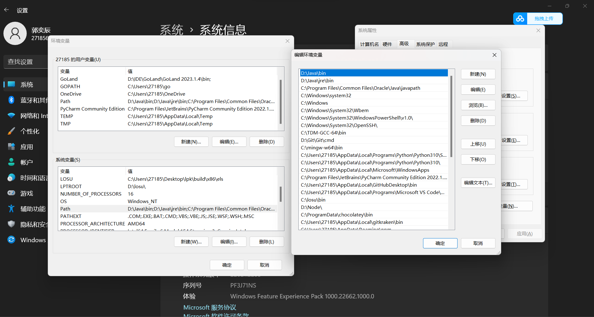
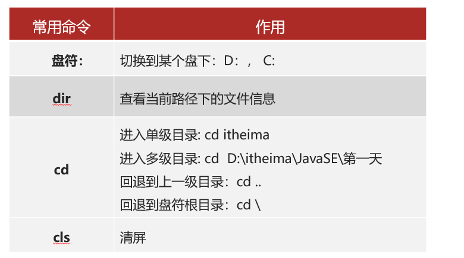
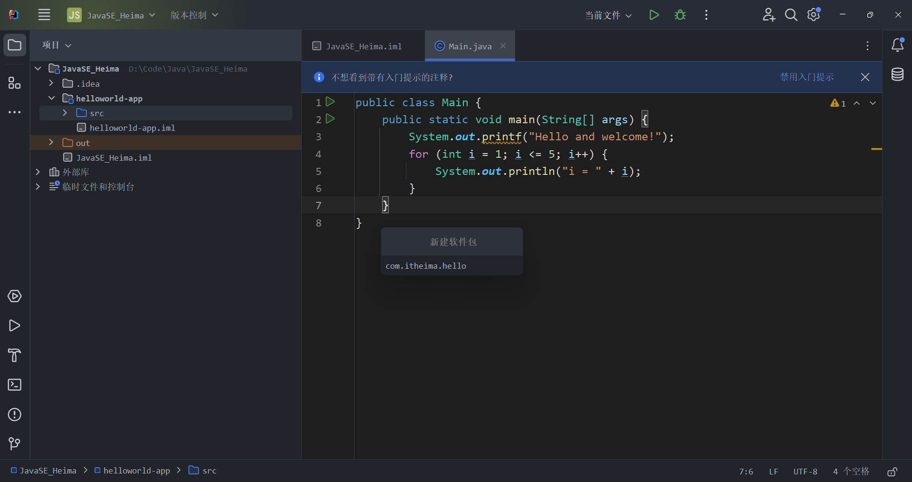
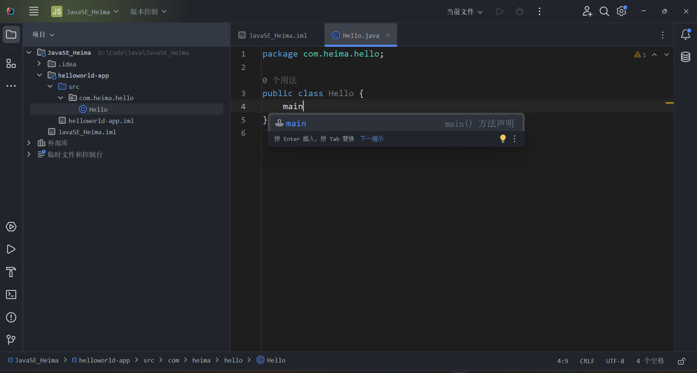
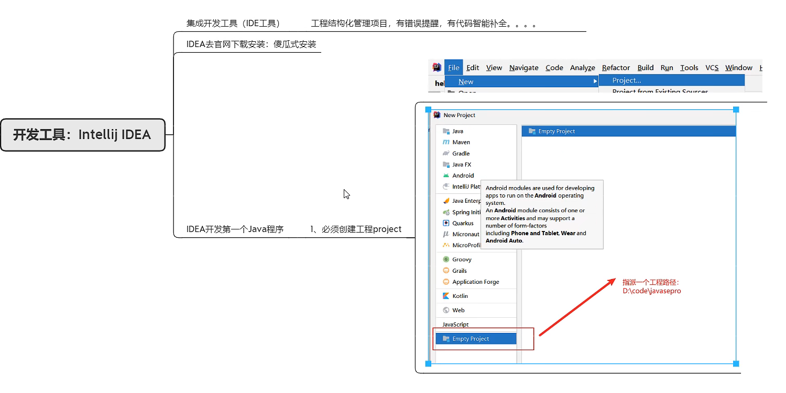

<br/>

> 第一周任务

> 

# 前言

## 背景


- 桌面应用开发中Java不常用


- 移动设备应用中Java不常用


## 环境配置

### JDK


- 下载及配置JDK过程略


- win+R打开cmd检测是否配置成功

```java
java --version
javac --version
```


### 环境变量


- path环境变量配置后即可在任意目录中启动程序，不配置的话需跳转到其程序所在目录才能启动


- 右键菜单选择系统再选择高级系统设置，选环境变量



- 选择系统变量中的Path再编辑，新建变量即可，复制 java\bin 和 Java\jre\bin 的目录添加两个变量（一般执行程序的文件都在bin目录下）
- 配置到用户变量可以只针对与当前登录的用户有效，切换用户后无法生效


- 在系统变量处选择新建，输入变量名和变量值，新建后就可以用 %变量名% 代替 变量值 ，即可以 %Java_Home% 代替 D:\Java
- 若Java_Home的变量值更改，即可只更改Java_Home的值便可顺带更改了Path中相关的环境变量


### IDEA

#### 安装


- 下载安装略，一般都去官网上下载


- Ultimata旗舰版支持JavaEE开发等功能，适合企业级开发，Community社区版不支持


- 卸载老版IDEA，打开控制面板选择程序，再选择卸载程序，右键卸载即可
- 安装IDEAIU（Ultimata）过程略

#### 基础设置


#### 常用快捷键


- ctrl+D 复制当前行并粘贴到下一行
- ctrl+alt+L 格式化代码
- ctrl+X 剪切当前行代码
- alt+shift+⬆/⬇ 将当前行代码上移/下移一行
- ctrl+/ 单行注释
- ctrl+shift+/ 多行注释

#### 其他操作


- 删除类文件：右键、delete
- 修改类名称：右键、重构、重命名
- 修改模块：右键、重构、重命名、重命名模块和目录（目录指在原文件夹中的名称）

> 打开文件在文件夹中所在的位置：右键、打开于、资源管理器

- 导入模块：


1. 必须选择所要导入的模块的 .iml 文件才能导入
2. 若所导入的模块位置不在工程所在目录下，导入后文件实际位置不在该目录下，若想使其位置在工程目录下，需复制文件夹到工程目录下再使用以上方式
3. 也可直接新建模块，再复制其他模块的src文件夹到该模块目录下

- 删除模块：先右键、移除模块，再打开其实际位置将其文件夹删除才能做到真正删除
- 打开工程：文件、打开，再选择相应文件夹即可（右下角有黑框）
- 关闭工程：文件、关闭项目

## DOS命令行窗口常用命令




- 切换盘只需 D: 或 C: 即可，无需cd
- dir可查看当前目录下目录与文件


- cd+目录名 可以切换到当前目录下的目录中，cd+目录地址可以切换到该地址目录（当前盘下才可以，不能跨盘），cd .. 为返回上一级目录


- 先cd到别的盘的某一目录，再切盘可以跳转到另一盘的目录中


- cd / 可以切换到本盘根目录下
- cls可用于cmd窗口清屏

```
cd D:
cd ..
cd /
cd xxx
dir
cls
```

## 编译运行java文件（javac+java 记事本＋命令行运行方式）


- 先javac后java，javac后会产生HelloWorld.class文件


- JDK11后可直接java+文件名编译运行，不产生.class文件


```
javac HelloWorld.java
java HelloWorld

java HelloWorld.java
```


## 原理方面

### 编程语言发展


- 打孔代表通电，不打不通电


### BUG


- debug抓虫子

### JDK


- JVM虚拟机，JRE运行环境，JDK开发工具，核心类库自身程序
- .java文件先通过JDK中的开发工具中的javac编译为.class文件，再通过java运行.class文件转到JRE的JVM中，再到核心类库运行


- 不同平台上都有JVM虚拟机


## IDEA第一个工程

### 结构


### 新建工程（project、module、package、class）


- 新建空项目，便于添加模块和包




- 包名一般为域名倒写，src为源文件目录


- 不用写 .java 后缀




- 输入main回车后可自动生成main函数


- 输入sout回车即可调用打印函数


- 右键运行或点击三角号运行文件


- 包名中一个 . 是一级目录


## 总结





# 基本知识

## 注释

### 单行注释

```java
// 1

/* 2 */
```

### 多行注释

```java
/*
 *
 */
 
/*

*/
```

<br/>

## 数据类型

### 内置数据类型

```java
类型        字节数      位数   默认值    范围
byte        1           8      0         -128~127 / -2^7~2^7-1
short       2           16     0         -32768~32767 / -2^15~2^15-1
int         4           32     0         -2^31~2^31-1(10位)
long        8           64     0L        -2^63~2^63-1(19位)
float       4           32     0.0f    
double      8           64     0.0d 
boolean                 1      false     true/false
char        2           16     '\u0000'  0~65535 / '\u0000'~'\uffff'
String/any object              null
```

#### 例子

```java
100l / 100L                     long
123.4f / 123.4F                 float
7. / 8.0 / 8.D / 7d / 12.9876   double
```

#### 表示方式

```java
前缀 0 表示八进制:        0144
前缀 0x 表示十六进制:     0x64
```

```java
char a = '\u0001';
String b = "\u0001";
String c = " \" This is a simple. \" ";
```

#### 转义字符

```java
符号      字符含义
\n        换行 (0x0a)
\r        回车 (0x0d)
\f        换页符(0x0c)
\b        退格 (0x08)
\0        空字符 (0x0)
\s        空格 (0x20)
\t        制表符
\"        双引号
\'        单引号
\\        反斜杠
\ddd      八进制字符 (ddd)              \122
\uxxxx    16进制Unicode字符 (xxxx)      \u0001
```

#### 内置函数(例)

```java
二进制位数:  Byte.SIZE
最小值:      Byte.MIN_VALUE
最大值:      Byte.MAX_VALUE
```

```java
包装类: java.lang.Byte
```

### 引用数据类型

```java
类似于C/C++的指针
引用类型指向一个对象，指向对象的变量是引用变量
这些变量在声明时被指定为一个特定的类型，比如 Employee、Puppy 等
变量一旦声明后，类型就不能被改变了

对象、数组都是引用数据类型
所有引用类型的默认值都是null
一个引用变量可以用来引用任何与之兼容的类型

例: People people = new People();
```

### 类型转换

*整型、实型（常量）、字符型数据可以混合运算。运算中，不同类型的数据先转化为同一类型，然后进行运算*

####  优先级

```java
低  ------------------------------------->  高
byte,short,char -> int -> long -> float -> double 
```

#### 规则

```java
1. 不能对boolean类型进行类型转换
2. 不能把对象类型转换成不相关类的对象
3. 在把容量大的类型转换为容量小的类型时必须使用强制类型转换
4. 转换过程中可能导致溢出或损失精度
```

#### 自动类型转换

```

```

#### 强制类型转换

```

```

#### 隐含强制类型转换

```

```

<br/>

## 运算符

### 算术运算符

```java
+ - * / % ++ --
```

### 关系运算符

```java
== != > < >= <=
```

### 位运算符

```java
& | ^ ~ << >> >>>
```

### 逻辑运算符

```java
&& || !
```

### 赋值运算符

```java
= += -= *= /= %=
<<= >>= &= ^= |=
```

### 条件运算符

```java
?:
```

### instanceof

```java
String name = "Yichen";
boolean result = name instanceof String; //name属于String类型,返回true
```

```java
class People{
  
}
class Girl extends People{
  
}
People p = new People();
People g = new Girl();

p instanceof People   //true
p instanceof Girl     //false
g instanceof Girl     //true
g instanceof People   //true
```

<br/>

## 修饰符

### 访问修饰符

```java

```

<br/>

## 输入输出

### 输出

```java
System.out.println()  //输出后换行
System.out.print()    //输出后不换行
```

```java

```

### 输入

```java
import java.util.Scanner;
```

```java
Scanner read = new Scanner(System.in);

byte i = read.nextByte();
short i = read.nextShort();
int i = read.nextInt();
long i = read.nextLong();
float i = read.nextFloat();
double i = read.nextDouble();
boolean i = read.nextBoolean();

String i = read.next();

char i = read.next().charAt(0);
```

<br/>

## 数组

### 定义

```java
int a[] = new int[5];

int a[];  a[] = new int[5];

int[] a = new int[5];

int[] a;  a[] = new int[5];
```

### 初始化

```java
int a[] = {1,2,3};
```

### 复制

```java
int boys[]={1,2,3};
int girls[]=new int[3];
girls = boys;           //销毁girls先前申请的空间，虚拟机自动回收垃圾
```

<br/>

## 枚举

```java
enum Color{
  red,green,blue;
}
```

```java
Color c = Color.red;
System.out.println(c);
```

```java
for(Color i:Color.values()){
  System.out.println(i);
}
```

```java
switch(c){
  case red:System.out.println("red");break;
  case green:System.out.println("green");break;
  case blue:System.out.println("blue");break;
}
```

```java
Color a[] = Color.values();               //返回枚举类中所有的值
for(Color i:a){
  System.out.println(i+" "+i.ordinal());  //枚举常量的索引
}
System.out.println(Color.valueOf("red")); //返回指定字符串值的枚举常量
```

<br/>

## 分支结构

```java
if(x>10){
  
}
```

```java
if(x<10){
  
}
else{
  
}
```

```java
if(x<100){
  
}
else if(x<1000){
  
}
else if(x<10000){
  
}
else{
  
}
```

```java
switch(i){
  case 1:i++;break;
  case 2:i--;break;
  default:i=0;
}
```

<br/>

## 循环结构

```java
while(a<10){
  
}
```

```java
do{
  
}while(a<10);
```

```java
for(int i=1;i<10;i++){
  
}
```

```java
int boys[] = {1,2,3,4};
for(int i:boys){
  System.out.println(i);    //输出1,2,3,4
}                           
```

```java
break;       //跳出循环
continue;    //立即结束本次循环进入下一次循环
```

# 类与对象

## 常量

*在程序运行时是不能被修改的*

*使用 final 关键字来修饰*

*虽然常量名也可以用小写，但为了便于识别，通常使用大写字母表示常量*

```java
final int X = 1;
final double PI = 3.1415926;
```

## 变量

### 局部变量

*定义在方法、构造方法或语句块中的变量，作用域只限于当前方法、构造方法或语句块中。局部变量必须在使用前声明，并且不能被访问修饰符修饰*

```java
public class Main(){
  public static void main(String args[]){
    
  }
  public void fanction(){
    int a = 10;     //局部变量
  }
}
```

### 成员变量/实例变量

- 储存在堆区
- *类生成的每个对象的成员变量是相对独立的*
- *定义在类中、方法之外的变量，作用域为整个类，可以被类中的任何方法、构造方法和语句块访问。成员变量可以被访问修饰符修饰*

```java
public class Main(){
  int a = 10;     //成员变量
  public static void main(String args[]){
    
  }
}
```

### 静态变量/类变量

- 储存在静态存储区，不会遇到垃圾回收
- *类生成的所有对象共享一个静态变量*
- *定义在类中、方法之外的变量，并且使用 static 关键字修饰，作用域为整个类，可以被类中的任何方法、构造方法和语句块访问，静态变量的值在程序运行期间只有一个副本。静态变量可以被访问修饰符修饰*

```java
public class Main(){
  static int a = 10;     //静态变量
  public static void main(String args[]){
    
  }
}
```

### 参数变量

#### 定义

*方法定义时声明的变量，作为调用该方法时传递给方法的值。参数变量的作用域只限于方法内部*

```java
public class Main(){
  public static void main(String args[]){
    
  }
  public void fanction(int a){      //参数变量
    
  }
}
```

#### 传值问题

##### 值传递

*在方法调用时，传递的是实际参数的值的副本。当参数变量被赋予新的值时，只会修改副本的值，不会影响原始值。Java 中的基本数据类型都采用值传递方式传递参数变量的值*

```java
public class Main(){
  static int a = 10;
  public static void main(String args[]){
    change(a);    //a的值并不会发生改变
  }
  public static void change(int x){
    x = 20;
  }
}
```

##### 引用传递

*在方法调用时，传递的是实际参数的引用（即内存地址）。当参数变量被赋予新的值时，会修改原始值的内容。Java 中的对象类型采用引用传递方式传递参数变量的值*

```java
public class Person(){
  static int x = 10;
  public static void main(String args[]){
    Person person = new Person();
    change(person);    
    //person.x的值会改变,且所有Person产生的对象的x的值都改变
  }
  public static void change(Person p){
    p.x = 20;
  }
}
```

## 方法

### 定义

```java
修饰符 返回值类型 方法名(参数类型 参数名){
  方法体
  return 返回值;  //void类型没有返回值,但可用 return; 跳出方法
}
```

```java
public static int change(int a){
  a = a + 3；
  return a;
}
```

### 重载

```java
int max(int a,int b){
  
}
float max(float a,float b){
  
}
```

### 构造方法

```java
class Person{
  int x;
  Person(int temp){
    x = temp;
  }
}
```

### 类方法

*用static修饰，只能操作类变量，不能操作实例变量，可以通过类名或对象名调用，只能调用类方法，不能调用实例方法，不能调使用super、this关键字*

```java
class Person(){
  static int x = 1;
  static void show(){
    System.out.println(x);
  }
}
```

### 实例方法

*能操作类变量和实例变量，只能通过对象名调用，能调用类方法和实例方法，能调使用super、this关键字*

```java
class Person(){
  int x = 1;
  void show(){
    System.out.println(x);
  }
}
```

### 命令行参数

```java

```

### 可变参数

```java

```

### finalize

```java

```

## 包

- *如果一个类定义在某个包中，那么 package 语句应该在源文件的首行*
- *如果源文件包含 import 语句，那么应该放在 package 语句和类定义之间。如果没有 package 语句，那么 import 语句应该在源文件中最前面*
- *import 语句和 package 语句对源文件中定义的所有类都有效。在同一源文件中，不能给不同的类不同的包声明*

一个类可能需要另一个类声明的对象作为自己的成员或方法中的局部变量，如果这两个类
在同一个包中，当然没有问题
如果一个类想要使用的那个类和它不在一个包中，要使用import语句完成使命

<br/>

## 类

- *一个源文件中只能有一个 public 类*
- *一个源文件可以有多个非 public 类*
- *源文件的名称应该和 public 类的类名保持一致*

### 定义

```java
class People{
  
}
```

<br/>

## 对象

### 创建

```java
class People{
  public static void main(String args[]){
    People people = new People();
    /*People people;
    people = new People();*/
    
    People p = people;        //会赋值
  }
}
```

<br/>

## 接口

### 规则

- *一个实现接口的类，必须实现接口内所描述的所有方法，否则就必须声明为抽象类*
- *类在实现接口的方法时，不能抛出强制性异常，只能在接口中，或者继承接口的抽象类中抛出该强制性异常        //？*
- *接口类型可用来声明一个变量，他们可以成为一个空指针，或是被绑定在一个以此接口实现的对象        //？*

#### 与类的相同点

```java
一个接口可以有多个方法
接口文件保存在 .java 结尾的文件中，文件名使用接口名
接口的字节码文件保存在 .class 结尾的文件中
接口相应的字节码文件必须在与包名称相匹配的目录结构中
```

#### 与类的不同点

```java
接口不能用于实例化对象
接口没有构造方法
接口中所有的方法必须是抽象方法，Java8之后接口中可以使用default关键字修饰的非抽象方法
接口中不能含有静态代码块以及静态方法(用 static 修饰的方法)
接口不能包含成员变量，除了 static 和 final 变量
接口不是被类继承了，而是要被类实现
接口支持多继承
```

#### 特性

```java
接口中每一个方法也是隐式抽象的,接口中的方法会被隐式的指定为 public abstract（只能是 public abstract，其他修饰符都会报错）
接口中可以含有变量，但是接口中的变量会被隐式的指定为 public static final 变量（并且只能是 public，用 private 修饰会报编译错误）
接口中的方法是不能在接口中实现的，只能由实现接口的类来实现接口中的方法
```

#### 改动

```java
JDK 1.8 以后，接口里可以有静态方法和方法体了
JDK 1.8 以后，接口允许包含具体实现的方法，该方法称为"默认方法"，默认方法使用 default 关键字修饰
JDK 1.9 以后，允许将方法定义为 private，使得某些复用的代码不会把方法暴露出去
```

### 声明

```java
interface Life{
  int age = 10;   <=>  public static final int age = 10; 
  void show();    <=>  public abstract void show();
}
```

### 实现

*当类实现接口的时候，类要实现接口中所有的方法。否则，类必须声明为抽象的类*

#### implements

```java
interface Life{
  int age = 100;
  void show(int a);
}
class People implements Life{
  public void show(int a){
    System.out.println("his age = "+a);
    System.out.println("normal life's age = "+age);
  }
}
```

### 继承

```java
public interface Life{
  void show();
}
public interface Performance{
  void eat();
}
public interface People extends Life,Performance{
  //借口可以多继承
  void move();
}
public class Person implements People{
  //必须实现接口的所有方法，除非声明为抽象类
  public void move(){
    
  }
  public void eat(){
    
  }
  public void show(){
    
  }
}
```

### 标记接口

*没有任何方法和属性的接口*

*实现一种新的数据类型*

```java
public interface Event{}
```

#### 作用

```
建立一个公共的父接口：
正如EventListener接口，这是由几十个其他接口扩展的Java API，你可以使用一个标记接口来建立一组接口的父接口。例如：当一个接口继承了EventListener接口，Java虚拟机(JVM)就知道该接口将要被用于一个事件的代理方案
向一个类添加数据类型：
这种情况是标记接口最初的目的，实现标记接口的类不需要定义任何接口方法(因为标记接口根本就没有方法)，但是该类通过多态性变成一个接口类型
```

<br/>

## 继承

- 支持单继承，多重继承(传递继承)，不同类继承同一类，不支持多继承(一个继承多个)
- 子类拥有父类非 private 的属性、方法
- 子类可以拥有自己的属性和方法，即子类可以对父类进行扩展
- 子类可以用自己的方式实现父类的方法(重写)

### extends

*类继承类*

```java
class Father{
  
}
class Son extends Father{
  
}
```

### implement

*类继承接口*

```java

```

### this

*指向自己的引用*

```java
class Father{
  int age = 40;
  void change(){
    this.age++;         //调用实例变量
  }
  void show(){
    this.change();      //调用实例方法
    
  }
}
```

### super

*实现对父类成员的访问，用来引用当前对象的父类*

```java
class Father{
  void show(){
    
  }
}
class Son extends Father{
  void showThis(){
    super.show();         //super=Father
  }
}
```

### final

*可用来修饰变量（包括类属性、对象属性、局部变量和形参）、方法（包括类方法和对象方法）和类*

#### 声明类

*把类定义定义为最终类，不能被继承*

```java
final class People{
  
}
```

#### 声明对象

*该方法不能被子类重写*

```java
public final void show(){
  
}
```

### 构造器

<br/>

## 重写

*子类对父类的允许访问的方法的实现过程进行重新编写, 返回值和形参都不能改变*

*外壳不变，核心重写*

```java
class People{
  int age = 1;
  void show(){
    System.out.println(this.age);
  }
}
class Girl{
  int age = 20;
  void show(){
    System.out.println("UnKown");
  }
  void change(){
    this.age++;
  }
}
```

```java
People people = new People();
Girl/People girl = new Girl();
people.show();    //输出"1"
girl.show();      //输出"UnKown"
girl.change();    //如果是People girl的话会报错，Girl girl不会报错
```

### 规则

```java
参数列表与被重写方法的参数列表必须完全相同
访问权限不能比父类中被重写的方法的访问权限更低
父类的成员方法只能被它的子类重写
声明为 final 的方法不能被重写
声明为 static 的方法不能被重写，但是能够被再次声明
构造方法不能被重写
如果不能继承一个类，则不能重写该类的方法

子类和父类在同一个包中，那么子类可以重写父类所有方法，除了声明为 private 和 final 的方法
子类和父类不在同一个包中，那么子类只能够重写父类的声明为 public 和 protected 的非 final 方法
重写的方法能够抛出任何非强制异常，无论被重写的方法是否抛出异常。但是，重写的方法不能抛出新的强制性异常，或者比被重写方法声明的更广泛的强制性异常，反之则可以
```

### super

*需要在子类中调用父类的被重写方法时，要使用 super 关键字*

```java
class People{
  int age = 1;
  void show(){
    System.out.println(this.age);
  }
}
class Girl{
  int age = 20;
  void show(){
    super.show();     //输出"1"
    System.out.println("Kown");
  }
}
```

<br/>

## 重载

*在一个类里面，方法名字相同，而参数不同，返回类型可以相同也可以不同*

*每个重载的方法（或者构造函数）都必须有一个独一无二的参数类型列表*

*最常用的地方就是构造器的重载*

```java
class Num{
  int max(int a,int b){
    if(a>b) return a;
    else  return b;
  }
  double max(double a,double b){
    if(a>b) return a;
    else  return b;
  }
}
```

```java
class People{
  int age(int a,String b){
    return a;
  }
  int age(String b,int a){    //参数列表变序也可
    return a;
  }
}
```

### 规则

```java
被重载的方法必须改变参数列表(参数个数或类型不一样)
被重载的方法可以改变返回类型
被重载的方法可以改变访问修饰符
方法能够在同一个类中或者在一个子类中被重载
无法以返回值类型作为重载函数的区分标准(不能参数列表相同,返回值不同)

被重载的方法可以声明新的或更广的检查异常
```

### 与重写区别

|区别点|重载方法|重写方法|
|:--|:--|:--|
|参数列表|必须修改|一定不能修改|
|返回类型|可以修改|一定不能修改|
|异常|可以修改|可以减少或删除，一定不能抛出新的或者更广的异常|
|访问|可以修改|一定不能做更严格的限制（可以降低限制）|

<br/>

## 多态

*消除类型之间的耦合关系 可替换性 可扩充性 接口性 灵活性 简化性*

*继承 重写 父类引用指向子类对象：Parent p = new Child();*

```java
public class Main{
  public static void main(String args[]){
    show(new People());   //3
    show(new Girl());     //1
    show(new Boy());      //2
    
    People p = new Girl();
    p.say();              //1
    Girl g = (Girl)p;
    g.say();              //1
  }
  public static void show(People p){
    if(p instanceof Girl){
      System.out.println(1);
    }
    else if(p instanceof Boy){
      System.out.println(2);
    }
    else{
      System.out.println(3);
    }
}
class People{
  void say(){
    System.out.println(3);
  }
}
class Girl{
  void say(){
    System.out.println(1);
  }
}
class Boy{
  void say(){
    System.out.println(2);
  }
}
```

```java
class People{
  public static void main(String args[]){
    People p = new Girl();
    p.show();    //虚拟方法: p是People的引用,却使用Girl类的show方法
  }
  int age;
  People(int x){
    age = x;
  }
  void show(){
    System.out.println(this.age);
  }
}
class Girl extends People{
  Girl(int x){
    super(x);       //继承构造函数
    this.age++;
  }
  void show(){
    System.out.println(this.age);
  }
}
```

### 实现方法

```
重写
接口
抽象类与抽象方法
```

<br/>

## 抽象类与抽象方法

### 抽象类

*抽象类除了不能实例化对象之外，类的其它功能依然存在，成员变量、成员方法和构造方法的访问方式和普通类一样*

*抽象类必须被继承，才能被使用*

```java
public abstract class People{
  //不能实例化对象
}
class Girl extends People{
  //继承和使用方法与普通类完全相同
}
```

### 抽象方法

*方法的具体实现由它的子类确定，只包含一个方法名，而没有方法体*

```java
public abstract class People{
  public abstract void show(int x);
}
class Girl extends People{
  public void show(int x){
    //方法体
  }
}
```

#### 规则

```java
如果一个类包含抽象方法，那么该类必须是抽象类
任何子类必须重写父类的抽象方法，或者声明自身为抽象类
```

### 规定

```java
抽象类不能被实例化，如果被实例化，就会报错，编译无法通过。只有抽象类的非抽象子类可以创建对象
抽象类中不一定包含抽象方法，但是有抽象方法的类必定是抽象类
抽象类中的抽象方法只是声明，不包含方法体，就是不给出方法的具体实现也就是方法的具体功能
构造方法，类方法（用 static 修饰的方法）不能声明为抽象方法
抽象类的子类必须给出抽象类中的抽象方法的具体实现，除非该子类也是抽象类
```

<br/>

## 封装

### 特点

```
良好的封装能够减少耦合
类内部的结构可以自由修改
可以对成员变量进行更精确的控制
隐藏信息，实现细节
```

### 示例

1. 修改属性的可见性来限制对属性的访问（一般限制为private）
2. 对每个值属性提供对外的公共方法访问，也就是创建一对赋取值方法，用于对私有属性的访问（getter和setter方法）

```java
class People{
  private int age;
  public int getAge(){
    return this.age;
  }
  public void setAge(int a){
    this.age = a;
  }
}
class Main{
  public static void main(String args[]){
    People p = new People();
    p.setAge(20);
    System.out.println("age = "+p.getAge());
  }
}
```
